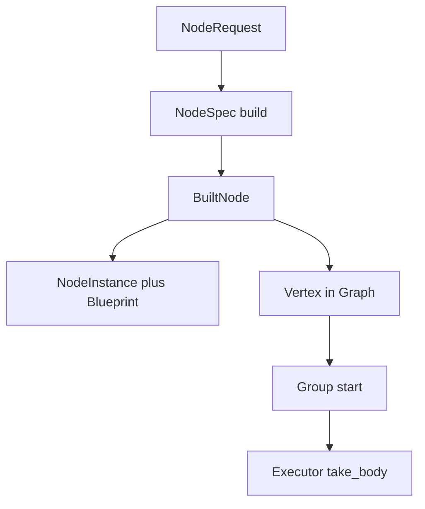

# avplumber_f7k architecture primer

This document is a map for changing the Rust core, not a catalogue of its
public API. Read module docstrings for local contracts and the refactor specs
under `doc/specs/rust-refactor/` for intended end state. This file describes
the code that is wired together now, including seams that are still
provisional.

## The three coordinate systems

Do not collapse these into a single notion of a “group.”

1. **Graph topology** says which node pad is connected to which edge. `Graph`
   owns `Vertex` records (one per logical node name) and explicit `EdgeLink`s.
2. **Execution placement** says which thread or cooperative runtime invokes a
   node body. `ExecCtxId` names a blocking domain, event loop, or tick source.
3. **Service membership** says which nodes observe shared clock, correction,
   or timeline state. Service names select `Arc`-owned state; they do not imply
   co-location.

In particular, a `SyncGroup` is a shared time mapping, not an executor. Audio
and video may read the same clock snapshot from different threads. Conversely,
nodes on one event loop need not share any service.

`Instance` is the composition root. It owns the graph, factory and service
registries, supervisor groups, ABI handles, and the named-edge namespace. It
does not run nodes itself.

## Module and directory map

```text
avplumber_f7k/
├── src/
│   ├── lib.rs                  composition root and crate-level exports
│   ├── core.rs                 authoritative native construction/lifecycle API
│   ├── graph/
│   │   ├── media.rs            owned payloads and timestamp access
│   │   ├── spec.rs             native stream/container descriptions
│   │   ├── timebase.rs         the only timestamp rescaling implementation
│   │   ├── edge.rs             event/flow contract and shared queue state
│   │   ├── buffered_edge.rs    queued cross-domain transport
│   │   ├── direct_edge.rs      capacity-one implementation; explicit only
│   │   ├── node.rs             native Node contract (body taken at start)
│   │   ├── poll_ctx.rs         readiness declarations made by Poll bodies
│   │   ├── pad.rs              pad declarations and media compatibility
│   │   ├── error.rs            executor-visible node failures
│   │   ├── capability.rs       capability/service IDs (C: generated avplumber_ids.h)
│   │   ├── buffer.rs           native rationals, media kinds, OpaqueFrame vtable
│   │   └── mod.rs              Graph, Vertex, EdgeLink; not an execution engine
│   ├── exec/
│   │   ├── blocking.rs         one OS thread per Blocking body
│   │   ├── async_rt.rs         one current-thread Tokio runtime per context
│   │   └── mod.rs              placement IDs and executor boundary
│   ├── supervisor/
│   │   ├── topo.rs             group-local topological ordering
│   │   └── mod.rs              membership, placement, start/stop ownership
│   ├── factory/mod.rs          JSON envelope, BuildCtx, factory erasure
│   ├── services/
│   │   ├── clock.rs            source-time to monotonic-time snapshots
│   │   ├── correction.rs       shared reference plus per-member cursors
│   │   ├── timeline.rs         named PTS-indexed JSON histories
│   │   └── mod.rs              typed and C-vtable registries
│   ├── control/mod.rs          script parser and graph-construction commands
│   ├── scaffold.rs             SisoNode + blocking/poll/async one-in/one-out adapters
│   └── abi/
│       ├── types.rs            flat AvpSpec / AvpBuffer / EdgeCoupling
│       ├── ffi_node.rs         C vtable wrapped as Node
│       ├── graph_mgmt.rs       C graph/group construction adapter
│       ├── edge_ops.rs         ownership transfer across the C boundary
│       ├── node.rs             C node implementation attachment
│       ├── registry.rs         C factories, media vtables, shared objects
│       ├── convert.rs          raw pointer ↔ owned Media conversion
│       ├── control.rs          C wrapper over the Rust control parser
│       └── mod.rs              opaque C handles and exported symbols
├── include/                    C ABI: handwritten API + generated avplumber_ids.h
├── tests/smoke_2node.rs        legacy substrate smoke coverage
└── parked/                     deliberately excluded nodes/shims/seek work
```

`graph/` is intentionally lower-level than `supervisor/`. An edge can exist
without a running group, and a graph records no scheduling policy.
`supervisor/` may inspect topology but should not acquire media-domain
responsibilities. `services/` is similarly independent of executor identity.

## Construction boundary

The desired native path is:

```text
flat node.add JSON
  → NodeEnvelope removes framework keys
  → NodeSpec deserializes the remaining node parameters
  → BuildCtx resolves named services/edges
  → BuiltNode returns Node + pads + placement + service hints + restart policy
  → Graph stores topology
  → Group materializes executors at start
```

`FactoryRegistry` accepts two factory shapes:

- a legacy factory returning only `Arc<dyn Node>`;
- a richer factory returning `BuiltNode`.

Both converge in `Instance::create_node`; the legacy result is promoted
to `BuiltNode` before topology is changed. Placement, restart policy, pad
declarations, and service hints are resolved there once. `BuildCtx::params`
contains the actual post-envelope JSON object.

`control/` parses syntax and invokes `core.rs` directly. `abi/graph_mgmt.rs`
performs only C-to-Rust adaptation before invoking the same operations. Native
construction never creates C handles.

The native edge registry owns named edge identity and incomplete endpoint
bindings. Once both `src` and `dst` endpoints exist, it inserts an `EdgeLink`
into `Graph`; implicit script edges and explicit `edge.add` edges therefore
have the same topology semantics. `Graph` retains its own name index because
it is the topology projection used by supervision, not a competing edge
owner.

## Vertex and other node-like objects

Several types carry a node name. Use this
section as the naming contract; do not invent a sixth “node” type when
wiring a new path.

`graph::Spec` is a **media format** (video size, codec id, …). It is not
`NodeSpec`. `Pad` in `graph/mod.rs` is an unused leftover; live pads are
`PadDecl` / `NodePads`.

### What each type is

| Type | Layer | What it is | Where it lives | Runnable? |
| --- | --- | --- | --- | --- |
| `NodeSpec` | factory | Constructor **for a node type** (e.g. all `ident` nodes). Deserialize leftover JSON, then `build` one `Node`. | `impl NodeSpec` registered via `register_spec::<S>` | No. A value exists only during one `build` call. |
| `BuiltNode` | factory | One construction result: `Arc<dyn Node>` plus pads, placement, restart, sync/correction hints. | Transient return from a factory; never stored | No. Folded into `NodeInstance` + `Vertex` immediately. |
| `Node` | graph | The **implementation**: name, pads, `bind_*`, `process`/`poll`/`run_async`, `start`/`stop`. C++ analogue: `Node`, not `NodeWrapper`. | `Arc<dyn Node>` held by `Vertex` and `NodeInstance` (same pointer) | Yes, once a `Group` start clones that `Arc` onto an executor. |
| `Vertex` | graph topology | The graph’s record for one logical name: impl pointer + pad→edge maps + pad media types. | `Graph.vertices` | No. Executors read it at start; they do not store a `Vertex`. |
| `NodeInstance` | `Instance` catalog | **This named node exists.** Lookup row: current `Arc<dyn Node>`, generation, pads, placement, policy, and the `NodeBlueprint` used to rebuild it. | `Instance.nodes` | No. Scheduling reads `Group` membership + `Vertex`. |
| `NodeBlueprint` | factory persistence | Constructor **for one named instance** (whatever string `create_node` used, e.g. `"ident0"`): which factory, canonical JSON, resolved placement/pads/policy. Survives restart. Does **not** keep a `NodeBody`. | `NodeInstance.blueprint` (`Arc`) | No. `blueprint.build()` returns a fresh `BuiltNode`. |
| `NodeRequest` | `core` API | Caller’s create arguments (type, name, JSON, optional placement/restart overrides). | Stack of `Instance::create_node` | No. |
| `NodeEnvelope` | factory | Framework keys stripped from JSON (`type`, `name`, `group`, `src`, `dst`, `event_loop`, …) before remaining keys become `NodeSpec`. | Parsing only | No. |
| `AvpNode` | C ABI | Stable opaque handle around the native `Arc`. Same pointer across restart; impl pointer inside is swapped. | `Instance.node_handles` | No. C `process`/`poll` go through `FfiNode` which **is** a `Node`. |

`SisoNode` is a one-in/one-out **transform helper**, not a graph vertex. Adapters (`SisoAdapter` / `SisoPollAdapter` / `SisoAsyncAdapter`) implement `Node`.

### `NodeSpec` vs `NodeBlueprint`

These are easy to collapse because both “build a Node.” They sit at different
scopes.

`NodeSpec` is the **type**. There is one impl per factory name
(`IdentSpec::TYPE_NAME == "ident"`). It is ordinary serde input: leftover JSON
after `NodeEnvelope` is stripped. `build(self, name, ctx)` is called on every
construction, including restart, and the `NodeSpec` value is dropped when
`build` returns. It does not know instance identity beyond the `name` argument.
Legacy `register(|name, json| …)` factories have no `NodeSpec`; they still
produce a `Node`.

`NodeBlueprint` is the **named instance**. There is one per logical name
chosen at create (the `name` field of `NodeRequest`, e.g. `"ident0"`). It stores
the resolved factory handle, the canonical JSON string (the same bytes that
will be deserialized into `NodeSpec` again), and the **already resolved**
placement, pads, and restart/service metadata. Restart does not re-parse
`NodeRequest` or `NodeEnvelope`; it calls `blueprint.build()` → factory →
(usually) `NodeSpec::build` → new `Node`.

| | `NodeSpec` | `NodeBlueprint` |
| --- | --- | --- |
| How many | one per node **type** | one per logical **name** |
| Holds JSON as | typed fields, live only in `build` | `canonical_params: String`, kept |
| Holds factory | the `impl` itself | `ConstructionRecipe` pointing at the registry entry |
| Holds the instance name | only as `build`’s `name` argument | `name` field, stable across generations |
| Holds `ExecCtxId` / pads / policy | no (those come from `BuiltNode` + request overrides) | yes, frozen at first `create_node` |
| When it exists | during factory invocation | from `create_node` until `destroy_node` |

A third object, `BuiltNode`, is the **return value** of one invocation: the
new `Arc<dyn Node>` plus whatever pads/placement/policy that invocation
claimed. It is not kept. `create_node` / reconstruct copy those fields into
`NodeInstance` and `NodeBlueprint`, then drop it.

### `NodeInstance`: what it is for

`Instance.nodes` is a name → `NodeInstance` map. Presence in that map is
what “the node exists” means for `create_node` (duplicate name),
`destroy_node`, `Instance::node`, control `src`/`dst` bind, and ABI
lookups. `Graph` having a `Vertex` is not consulted for those.

Callers use a `NodeInstance` as a snapshot of the current generation:

- `node` — same `Arc<dyn Node>` as `Vertex.node` (kept in sync on
  reconstruct and `replace_node_impl`).
- `active_generation` — writer/reader lease id for `connect_edge` /
  `bind_edge`. This is the field `NodeBlueprint` does not have.
- `pads` — so script `node.add` can bind `src`/`dst` immediately without
  walking the `Vertex`.
- `exec_ctx`, `restart`, `on_error`, `service_hint` — copied **into**
  `Group` at `add_group_member`. After that, the running group’s own maps
  are what start/stop/policy consult. `NodeInstance` remains the source
  used to reject a policy-bearing node in a second group.
- `blueprint` — the only handle reconstruct has to build generation N+1.

`Group::start` does **not** read `NodeInstance`. It walks member names,
loads each `Vertex`, and clones `vertex.node` onto an executor. If you
need topology or the live impl pointer, use `Vertex`. If you need “does
this name exist, what generation, how do I rebuild it,” use
`NodeInstance`.

Pads/placement/policy appear on both `NodeInstance` and `NodeBlueprint` by
copy at create time. Reconstruct validates the new `BuiltNode` against the
**blueprint**, then writes a replacement `NodeInstance`. Do not treat the
two structs as independently mutable.

### `Vertex`

A `Vertex` is the topology cell for one logical node name. It is not a
scheduler object and not a factory object.

Fields:

- `name` — stable logical identity (the create-time instance name, e.g.
  `"ident0"`). Same string as `NodeInstance.name` and `Node::name()`.
- `node` — `Arc<dyn Node>` for the **current generation**. Restart replaces
  this pointer; the `Vertex` itself stays.
- `sources` / `sinks` — pad name → `Arc<dyn Edge>`. Empty until
  `connect_edge` / `bind_*`. The maps hold the logical edge, not a
  generation view.
- `source_media` / `sink_media` — pad name → `AvpMediaType`, copied from
  `NodePads` at create/reconstruct so connect can type-check without
  calling the impl.

`Graph` also stores `EdgeLink`s (named hop: producer pad → consumer pad +
edge). A vertex’s maps are the per-node index of those same `Arc`s.
`Instance.edges` is the named-edge registry that **creates** those `Arc`s;
`Graph` is the topology projection the supervisor walks.

Do not put restart policy, `ExecCtxId`, or a blueprint on `Vertex`. Those
belong on `NodeInstance` / `NodeBlueprint`. Do not put queued media on
`Vertex`; media lives on the `Edge`.

### C++ `NodeWrapper`

C++ had two types:

- `Node` — impl (`process`, `start`, optional non-blocking base).
- `NodeWrapper` — named instance: owns `shared_ptr<Node>`, the OS thread
  or event-loop attachment, start/stop, group membership, JSON params,
  `onFinished`.

Mapping:

| C++ `NodeWrapper` duty | Rust owner |
| --- | --- |
| Hold the impl pointer | `Vertex.node` and `NodeInstance.node` (same `Arc`) |
| JSON params / factory identity | `NodeBlueprint` |
| Group membership | `Group` member list |
| Thread / event loop | `ExecCtxId` on `NodeInstance`, materialized as an `Executor` at `Group::start` |
| `start` / `stop` / join | `Group` (not `Node::start`, which is an impl hook) |
| `onFinished` | `NodeOutcome` → group manager |

There is no `NodeWrapper` type in this crate. Inheritance is a `Node` trait
plus optional `SisoNode`; there is no wrapper base class.

### Same name, different pointer (restart)

Logical instance name (e.g. `"ident0"`) is stable. After `restart_group`:

- `NodeBlueprint` is the same `Arc`.
- `Vertex` is the same map entry; `vertex.node` is a **new** `Arc<dyn Node>`.
- `NodeInstance` is replaced in `Instance.nodes` with `active_generation`
  incremented; pads/placement must match the blueprint (`validate_replacement`).
- Logical `Edge` `Arc`s stay; writers are generation-fenced.
- The previous `Arc<dyn Node>` is dropped after publish (C destroy runs
  then, not while graph locks are held).

`Node::take_body` wraps `process`/`poll`/`run_async` for **one** executor
run. The `Vertex` still holds the `Arc`. After `Group::stop`, executors
are gone; the `Vertex` and `NodeInstance` remain until `destroy_node` or
the next reconstruct.

### Example: create, run, restart, destroy

Concrete names in this walk-through are examples, not keywords: node
**type** `ident` (`IdentSpec: NodeSpec`), instance **name** `"ident0"`,
pads `in` / `out`, group `"g"`.

**Create** (`Instance::create_node`):

```text
NodeRequest { type_name: "ident", name: "ident0", params: {} }
  → FactoryRegistry.resolve("ident")          // Built factory from register_spec
  → JSON → IdentSpec (NodeSpec)
  → IdentSpec::build("ident0", &BuildCtx)     // produces Ident: Node
  → BuiltNode { node: Arc<Ident>, pads, placement, restart: Off, … }
  → NodeBlueprint stored (recipe + canonical JSON)
  → NodeInstance inserted in Instance.nodes   // catalog, generation 1
  → Vertex { name: "ident0", node: same Arc, empty pad maps } in Graph
```

`"ident0"` exists and can be connected. Nothing is scheduled yet.

**Connect** (`connect_edge("d1", "src", "out", "ident0", "in", Direct)`):

```text
named Edge Arc created or reused
  → EdgeLink in Graph
  → Vertex "src".sinks["out"] = edge
  → Vertex "ident0".sources["in"] = edge
  → Ident::bind_source("in", generation_reader(edge, 1))
```

**Start** (`start_group("g")` after `add_group_member("g", "ident0")`):

```text
Group manager: Idle → Starting
  → read Vertex "ident0" (not NodeInstance) for Arc + incident edges
  → Executor::add_node(vertex.node, sources, generation_writer(sinks, gen))
  → Node::take_body() once for this run
  → executor start → Running
```

`Node::start` on the impl may run as a hook; the **group** start is what
creates threads/runtimes.

**Restart** (member fails with `RestartPolicy::RestartGroup`):

```text
Group: Running → Quiescing (stop executors) → Backoff 1s
  → reconstruct_group: blueprint.build() → new Arc<Ident>
  → validate pads/placement against the old NodeInstance
  → swap Vertex.node and Instance.nodes["ident0"]
  → fence writers, Internal-reset in-group edges, rebind pads
  → start generation 2 on the new Arc
```

The logical name, `Vertex` slot, `NodeBlueprint`, and edge `Arc`s are
unchanged. A new `Node` object is required because `take_body` was already
taken for generation 1.

**Stop then destroy**:

```text
stop_group("g")     // executors join; Vertex and NodeInstance remain
destroy_node("ident0") // group must be Idle
  → Group::remove("ident0")
  → destroy incident named edges
  → Instance.nodes.remove
  → Graph.remove_vertex
  → last Arc<dyn Node> drops (C AvpNode destroy if any)
```

`destroy_node` while the group is not Idle is an error. Dropping `Instance`
stops groups first; do not rely on `Vertex` outliving `NodeInstance`.



## Payload and format ownership

The native data path owns values:

- `Media` owns rsmpeg frames/packets when `ffmpeg` is enabled.
- `OpaqueFrame` owns a foreign object through retain/release callbacks.
- `Spec` describes the format in force on an edge.
- `Ts` carries value and timebase together; rescaling is explicit.

Raw pointers belong in `abi/convert.rs` and `abi/edge_ops.rs`. Moving a frame
through the C boundary transfers ownership; it is not a borrowed view.
`AvpBuffer`, `AvpSpec`, `AvpRational`, and media vtables are ABI projections,
not an alternative internal model.

`AvpSpec` is intentionally lossy. The native audio representation can retain a
custom channel map, whereas the flat C struct cannot. The current native
`PacketSpec` is still only `codec_id` plus extradata; it does **not** yet own a
complete FFmpeg `AVCodecParameters`, despite the design target. Code that needs
codec parameters must close this gap rather than smuggle an
`AVFormatContext` through a capability query.

Timestamps on media edges are source-time. Clock services map that timeline to
release time; they do not rewrite queued timestamps. A future Sentinel is the
continuity producer and is the documented exception.

## Edge types

There is one `Edge` trait. Nodes pull (`take` / `try_take`) and push
(`offer` / `push_event`); they do not name a queue implementation.

**`BufferedEdge`** is the default. `EdgeKind::Buffered { capacity: 0 }`
(and C `AvpEdgeCoupling` with `is_direct == 0`, `capacity == 0`) becomes
64 slots. `Instance::bind_edge`, script `src`/`dst`, and
`queue.plan_capacity` always build this kind. Use it across a blocking
thread boundary or wherever a burst must sit in the pipe.

**`DirectEdge`** is **capacity 0**: no stored frame after `offer` returns.
`offer` runs the consumer on the same executor; if that node’s outputs are
also Direct, the call continues until a Buffered edge or a sink. `Push::Full`
is congestion at that far end, so the original producer stays Idle until
*that* edge is writable — a Direct-only chain is one backpressure domain.
`is_full` and writable wait follow the unique output of the consumer (the
tail). Never fuse across a blocking or async node (`connect_edge` rejects
those — the producer’s OS thread would stall, and async bodies are not
`poll`). Selection is still explicit `connect_edge(..., EdgeKind::Direct)`
(not inferred from co-location).

Control events (Spec, Flush, Eof) never take a buffer slot, so EOF/flush
cannot stall behind a full media queue. Direct keeps them on a side queue;
Buffered uses `EdgeQueue` for both events and media. `FlushStart` discards
queued buffers, keeps events, then appends itself. EOF closes later buffer
`offer`s but remains an item for the consumer.

`Spec` is queued and latched. `rearm_spec` makes the last format visible
again to a newly attached consumer. The present implementation can expose
the latched Spec separately from the queued Spec event — do not depend on
exact delivery count without a test.

Blocking `take(timeout < 0)` parks on a condvar. Poll/async use
`EdgeReady` (register waker, recheck) so an item that arrives between the
empty check and registration is not lost. `Wakeup` keeps **all** registered
task wakers (a Direct producer and the next Poll node can both wait writable
on the same Buffered tail). The C `notify_*` callback is still one per
direction. Fan-out of edges would still need different readiness ownership.

Never call node code or push to another edge while holding an edge or
service mutex: implementations drop the queue lock before firing wakers.

## Node bodies and execution

`Node` describes identity, pads, lifecycle hooks, capabilities, and how edges
are bound. `take_body` converts an `Arc<Node>` into exactly one run strategy:

- `Blocking` repeatedly executes synchronous work on a dedicated OS thread.
- `Poll` executes on a named current-thread runtime and declares what should
  wake it through `NodePollContext`.
- `Async` supplies a future run on the same cooperative runtime.

The strategy follows the operation, not the implementation language. A native
Rust codec call is still Blocking if FFmpeg can block or monopolize the thread.
Poll is appropriate when one bounded step and explicit readiness are clearer
than a future. Async is appropriate for waiting on several independent inputs
or an input plus a clock.

`Tick::Again` is fairness-limited before yielding. `Tick::Idle` must register
at least one wake condition; otherwise the task may park indefinitely. A
deadline is a complete wake condition: the async executor installs a Tokio
timer, so a deadline-only Poll body wakes without an edge event or external
tick. Cancellation wakes and drops that park's timer before executor join; a
later executor run cannot inherit the stale deadline. A successful terminal
body is reported to the supervisor without touching output
edges. The supervisor first resolves clean/error restart policy: natural clean
completion with policy Off emits EOF once, while a RestartGroup boundary is
fenced and reconstructed without exposing an intermediate EOF. Nodes should
not reproduce that lifecycle rule.

`Group` assigns members to executors after a group-local topological sort. All
Blocking members share a `BlockingExecutor` object, which then creates one
thread per body. Each distinct EventLoop or TickSource ID receives a separate
`AsyncExecutor` and therefore a separate OS thread/current-thread Tokio
runtime.

Service-group names can inform default placement, but explicit placement is
legal even when it differs. The supervisor logs that situation; it must not
reject it.

## Shared services

### SyncGroup

`clock.rs` separates a lock-free read path from serialized mutation. Readers
load one immutable `ClockSnapshot` through `ArcSwap`; reset, rate, pause, and
offset-join operations publish a replacement snapshot. All source timestamps
are normalized to microseconds before wall mapping. The wall epoch is process
monotonic, not civil time.

The important invariant is snapshot coherence across threads, not executor
co-location. `join_offset` elects the minimum offset with an atomic compare
loop; this is the cross-stream buffering rule inherited from realtime teams.
Only clocks whose `live_position` returns `Some` are wall-advancing clocks.
`SourceTimeClock` returns `None`, so a file timeline cannot move merely because
wall time passed. `SyntheticClock` exposes a programmable live position for
deterministic service tests.

### CorrectionGroup

The correction service owns coordination state, not correction policy. It has
one shared reference timestamp and one `next_ts` cursor per member. A member
takes a snapshot, computes without the mutex, performs edge work without the
mutex, then commits against a generation. A stale generation forces
recalculation.

For live correction, `expected_ts` advances to the SyncGroup's current source
position, derived from process-monotonic elapsed wall time and the clock rate.
Advancement is monotonic, remains in `output_tb`, and never rewrites the locked
shift or member cursors. Clock calculation happens outside the correction
mutex; only the final compare-and-publish is serialized. If correction
generation or output timebase changes during that calculation, advancement
retries from a coherent snapshot rather than publishing a stale candidate.
Once a group is live-driven, member commits advance only that member's cursor;
they do not drag the wall-derived expected timestamp into the future.

Do not move slew/rebase/drop/fill or backup-frame generation into this service.
Those decisions depend on stream media and belong in Sentinel nodes.

### Continuity across restart

Nodes that must preserve output continuity (Sentinel/correction, encoder, mux,
and output) must live outside the restartable input group. Every edge crossing
from that input group must be Buffered. The Buffered edge is the stable egress
identity across reconstruction: restart fences the old generation's writer,
removes restart EOF, retains already accepted bounded media, and binds the new
generation to a fresh writer view. This boundary guarantees that stale media
cannot enter the persistent pipeline and that group reconstruction is not
observable as EOF.

The persistent Sentinel policy may emit frozen video or silence while input is
absent. Its PTS must follow the persistent correction timeline rather than a
new input generation's source origin, so recovery cannot introduce a duplicate
or backward timestamp. A late Sentinel emits sequential `member_cursor.next_ts`
slots and commits one cadence step at a time until it catches `expected_ts`; it
must not jump directly to the latest expected slot. When its cursor is ahead,
the SyncGroup mapping determines the next wake deadline. Automatic and manual
reconstruction use the same edge fencing and service identities.

### Timeline

Timelines are named stores of JSON values indexed in milliseconds. Lookups
rescale the frame timestamp before searching. GC retains the last entry before
the cutoff because it remains the effective value after the cutoff.

The `TypeId` registry in `services/mod.rs` is an extension point; clocks,
corrections, and timelines currently use dedicated named registries. C service
vtable registration is a separate adapter surface and is not wired as the
native lookup mechanism.

## ABI boundary

`abi/` adapts the native substrate; it must not become a second graph model.
`AvpNode` and `AvpEdge` are handles around native `Arc`s. `FfiNode` converts the
C vtable's process/poll return codes into native body outcomes.

The dependency direction is `control → core` and `abi → core`. Native code
must not serialize arguments into C strings or call exported `avp_*` symbols.

The C++ compatibility shim, pyplumber bridge, seek helper, and old node
sketches are in `parked/` and are not compiled. Their presence is historical
context, not evidence that those integration surfaces work.

When changing a native contract, first decide whether the C ABI needs a lossy
projection or no exposure yet. Do not shape the native type around what is
convenient to express in a flat C struct. Capability and service IDs are
defined in Rust (`capability.rs`); `include/avplumber_ids.h` is cbindgen
output. Do not edit that header, and do not generate Rust from the C headers.

## Current sharp edges

This core is suitable for architecture review, not yet as a trusted runtime.
The following are implementation facts, not roadmap speculation:

- RestartGroup is group-scoped; a policy-bearing node must belong to exactly
  one supervisor group before start/restart. Isolated `restart_node` remains
  intentionally unsupported: `on`, boolean `true`, and `restart_node` are
  rejected instead of being reinterpreted. `group`/`restart_group`,
  `panic`, `exit`, and `off` are explicit actions. Automatic and manual
  restarts use the same generation-fenced reconstruction transaction and
  fixed one-second retry. Panic and Exit first dispatch off the manager thread
  and shut the instance down; Panic then escalates distinctly.
- `Group::stop` computes reverse topological order but stops executor sets in
  hash-map order; sink-first shutdown is not implemented.
- Live node add/remove is unsupported. The current API warns and ignores the
  mutation instead of returning an error.
- The Async cancellation branch and Poll tick waits share a `Wakeup`; tick
  consumption and cancellation need dedicated contract tests.
- Clock pause/resume and concurrent offset joins still need focused tests.
- The smoke test exercises the blocking ABI path and verifies that native
  control creates no ABI handles. It does not validate Poll/Async scheduling,
  richer factory metadata, or cross-thread services.

Address these seams before building nodes that would encode accidental
behavior into their contracts.

## Where to enter for common changes

- **New native node contract:** start with `factory/mod.rs`,
  `graph/node.rs`, and `graph/pad.rs`; verify how `graph_mgmt.rs`
  consumes the result before writing the node. If a type is named
  “node”, check **Vertex and other node-like objects** before adding
  another record.
- **Backpressure or event behavior:** start with `graph/edge.rs`; both edge
  implementations must remain protocol-equivalent.
- **Scheduling behavior:** trace `Group::start` into `Executor::add_node`, then
  the selected executor. Do not infer runtime placement from service names.
- **Clock/correction behavior:** preserve short mutation critical sections and
  keep locks out of edge operations.
- **C integration:** implement the native behavior first, then adapt it in
  `abi/`; avoid adding raw-pointer state to `Instance` unless its ownership is
  explicit.
