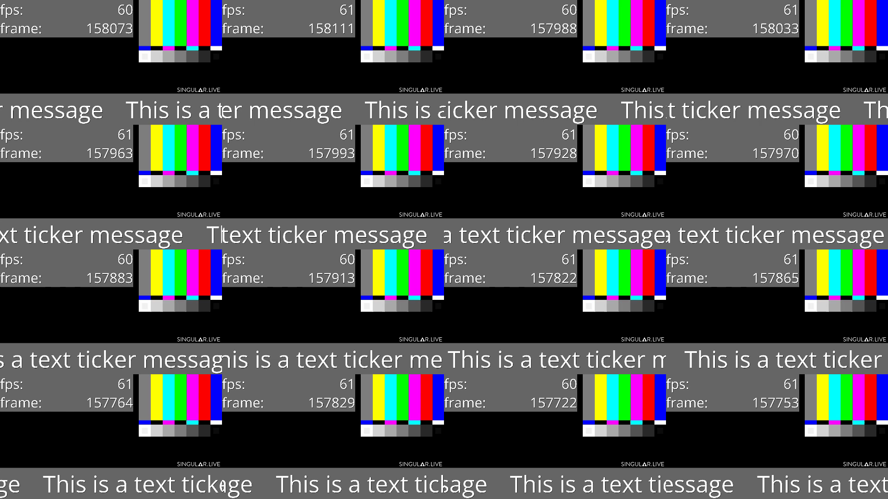

# dmabuf-browser — browser overlay → avplumber → Janus (WebRTC)

Render a single HTML page (any URL — e.g. a broadcast graphics overlay)
headlessly in Electron, export each frame as a GPU **DMA-BUF** (zero-copy), feed
it into an **avplumber** graph, and stream it to **Janus** for WebRTC preview in
a browser.

[](https://amagimedia.github.io/avplumber/download.html?file=demos%2Fdmabuf-browser%2Fdocs%2F16-input-grid-10s.mp4)

[Watch or download the 10-second MP4 demo](https://amagimedia.github.io/avplumber/download.html?file=demos%2Fdmabuf-browser%2Fdocs%2F16-input-grid-10s.mp4). It shows
16 independent 1920x1080@60 browser captures, grouped as two Electron processes
with eight windows each, composed into one 1920x1080@60 output. The file contains
exactly 600 consecutive frames encoded by NVENC at about 12 Mbit/s. DMA-BUF
import, scaling, composition, and encoding stay on the GPU; only the compressed
H.264 packets reach the file muxer. The reference run used about **42% GPU
utilization**
on the single 70 W Tesla T4 supplied by an entry-level AWS EC2
G4dn instance; no larger GPU was required. That leaves headroom for a second
16-source scene—**32 independent 60 fps browser captures** in total. Treat that as
a capacity target rather than a universal limit because Chromium rendering
cost depends on page content.

NVIDIA needs Chromium's renderable SharedImage without the CPU-linear
allocation constraint. The recommended route is the supplied GBM shim with a
stock Electron binary; it has been exercised with Electron 41 / Chromium 146
and Electron 43 / Chromium 150. Users who do not want `LD_PRELOAD` can build
Electron with the two source patches in this directory. Do not combine the two
routes.

```
 ┌─────────┐   wayland    ┌──────────────┐  dmabuf fd (unix socket)  ┌───────────┐   RTP    ┌────────┐  WebRTC  ┌─────────────┐
 │ wayland │─ display ───▶│  dma-browser │──────────────────────────▶│ avplumber │────────▶│ janus  │─────────▶│ janus-preview│
 │ (sway)  │              │   Electron   │   /tmp/dma-page/*.sock    │  graph    │  :5004   │        │  :8088   │  (browser)  │
 └─────────┘              │ patch or shim│   48B TexInfo + FD        └───────────┘          └────────┘          └─────────────┘
                          └──────────────┘
```

## How DMA-BUF sharing reached Electron

The browser did not always expose a reusable GPU allocation to embedders.
Reito OvO's [Chromium CL 5276423](https://chromium-review.googlesource.com/c/chromium/src/+/5276423)
first let capture write RGBA into an existing native GPU texture. The related
[CL 5265077](https://chromium-review.googlesource.com/c/chromium/src/+/5265077)
then added native-texture GPU-memory-buffer output to
`FrameSinkVideoCapturer`, explicitly for accelerated consumers such as CEF
OSR, Electron, and OBS. Their
[Chromium change history](https://chromium-review.googlesource.com/q/author:reito@chromium.org+or+author:carolwolfking@gmail.com)
contains the follow-up tests and format fixes.

Electron's `useSharedTexture` offscreen API builds on that work. On Linux it
delivers a `NativePixmap` containing the DMA-BUF file descriptor plus its
stride, offset, and DRM modifier. avplumber keeps the buffer on the GPU and
imports those fields through EGL; it does not assume that the pixels are laid
out linearly.

## The NVIDIA allocation problem

Electron 41 and 43 request `kPreferMappableSharedImage`. On Linux that leads to
`SCANOUT_CPU_READ_WRITE`, which includes `GBM_BO_USE_LINEAR`. This is useful
when a CPU may need to map the buffer, but the affected NVIDIA GBM path cannot
also use that linear allocation as Chromium's render target. NVIDIA instead
needs a native tiled/block-linear allocation whose modifier is exported with
the DMA-BUF.

[Chromium CL 6681354](https://chromium-review.googlesource.com/c/chromium/src/+/6681354),
landed in August 2025 as
[commit `a531c83a`](https://chromium.googlesource.com/chromium/src/+/a531c83a9bbb552fa13ceeaf73d0a19d1203cc12),
added the internal `kPreferSharedImageWithNativeHandle` choice. It sets
`requires_cpu_access=false`, so the pool requests `SCANOUT` rather than
`SCANOUT_CPU_READ_WRITE` and does not imply `GBM_BO_USE_LINEAR`.

This is a consumer-level C++/Mojo API: “consumer” means Electron's internal OSR
capture component, not a web page or command-line user. Chromium kept the
mappable default because Chrome may need a CPU-readable buffer for software
encoder fallback, and the review found that changing the policy globally broke
other GPU configurations. Consequently, stock Chrome and Electron have no
official flag that selects the NVIDIA-friendly allocation.

Two pieces were then lost in translation:

1. Electron 41 and 43 still select
   [`kPreferMappableSharedImage`](https://github.com/electron/electron/blob/v43.4.0/shell/browser/osr/osr_video_consumer.cc#L80-L87).
2. CL 6681354 allocated the native handle but did not add that new preference
   to `FrameSinkVideoCapturerImpl`'s GPU texture/blit-result condition. The
   follow-up [Chromium CL 8220427](https://chromium-review.googlesource.com/c/chromium/src/+/8220427)
   fixes this; it was still under review on 2026-08-13.

This is why changing only Electron's enum is incomplete, and why the source
build below carries two patches.

## Recommended: stock Electron with the GBM shim

The shim avoids a Chromium build. “Stock Electron” here means an official
Electron binary with its unmodified embedded Chromium, not standalone Google
Chrome: the demo needs Electron's offscreen shared-texture API. The path has
been exercised with Electron 41.3.0 / Chromium 146 and Electron 43.4.0 /
Chromium 150.

For example:

```bash
npm --prefix deps/dma-browser run rebuild:shim
LD_PRELOAD="$PWD/deps/dma-browser/native/gbm-linear-shim/libgbm_linear_shim.so" \
GBM_LINEAR_SHIM=1 \
GBM_LINEAR_SHIM_ADD_SCANOUT=1 \
DMA_BROWSER_FORCE_NVIDIA=1 \
ELECTRON_BIN=<path-to-stock-electron> \
deps/dma-browser/bin/run.sh
```

Always compile the C source on the target host; the generated `.so` is native
to that host's CPU architecture and is intentionally ignored by Git. Once it is
preloaded, the shim intercepts `gbm_bo_create`,
`gbm_bo_create_with_modifiers2`, `gbm_surface_create`, and
`gbm_surface_create_with_modifiers2`. For each allocation it performs exactly:

```c
flags &= ~GBM_BO_USE_LINEAR;    // clear 0x10
flags |= GBM_BO_USE_SCANOUT;    // set 0x01
flags |= GBM_BO_USE_RENDERING;  // set 0x04
```

It then calls the real GBM function through `RTLD_NEXT`. The shim does not
allocate pixels, copy a frame, change Chromium's feature registry, or touch
video decoding. Stock Electron remains on its established mappable
texture/blit path; only the final GBM request loses the CPU-linear constraint.
NVIDIA can therefore choose a renderable tiled allocation, Electron exports
its DRM modifier, and avplumber imports it correctly through EGL.

The trade-off is scope: `LD_PRELOAD` changes every matching GBM allocation in
that Electron process, and the shim itself does not detect the GPU vendor. Load
it only for the NVIDIA browser process. `GBM_LINEAR_SHIM_LOG=1` prints original
and rewritten flags. The source is
[`gbm_linear_shim.c`](../../deps/dma-browser/native/gbm-linear-shim/gbm_linear_shim.c).

## Alternative: build Electron without the shim

The source route is narrower at runtime and remains vendor-neutral when its
feature is disabled. It needs both bundled patches:

- [`chromium-native-handle-texture-capture.patch`](chromium/chromium-native-handle-texture-capture.patch)
  carries the production part of CL 8220427, making Chromium use its GPU
  texture/blit path for the native-handle preference.
- [`electron-offscreen-native-handle.patch`](chromium/electron-offscreen-native-handle.patch)
  gives only Electron's `useSharedTexture` OSR consumer a disabled-by-default
  runtime choice between the upstream mappable behavior and the native-handle
  behavior.

Install the prerequisites from Electron's
[Linux build instructions](https://www.electronjs.org/docs/latest/development/build-instructions-linux),
then run:

```bash
cd demos/dmabuf-browser/chromium
BUILD_JOBS=8 ./build-electron.sh
```

The default is Electron 41.3.0 / Chromium 146.0.7680.188, matching
`deps/dma-browser/package.json`. For Electron 43.4.0 / Chromium 150.0.7871.224:

```bash
BUILD_JOBS=8 ./build-electron.sh 43.4.0
```

[`build-electron.sh`](chromium/build-electron.sh) creates an isolated checkout
under `chromium/work/`, syncs the requested Electron and Chromium revisions,
applies both patches, builds `electron:electron_dist_zip`, and writes the zip
and checksum to `chromium/artifacts/`. It refuses to reset, retarget, or patch a
dirty checkout. Both patches are source-application checked against the exact
146 and 150 versions above; the stock-shim path is the one runtime-tested here.

The patched binary needs:

```text
--enable-features=RenderableMappableSharedImageForceScanout
```

`deps/dma-browser/bin/run.sh` adds that feature only after detecting NVIDIA (or
when `DMA_BROWSER_FORCE_NVIDIA=1` is set). With the feature disabled, the same
binary follows upstream behavior on Intel, AMD, and NVIDIA; neither patch
hardcodes a GPU vendor or CPU architecture. Keep the Electron version in
`deps/dma-browser/package.json` and the `fdpass` native-addon rebuild target
aligned with the custom binary.

## The settings that actually matter

### 1. Sender = Electron 41.3.0 (Chromium 146)

- `deps/dma-browser/package.json` pins `electron` to `41.3.0`.
- Use either the patched Electron build or the stock-build shim described
  above; do not apply both allocation rewrites simultaneously.
- The patched feature is enabled only on the NVIDIA path; without the runtime
  flag, the patched binary retains upstream Electron behavior.
- Note: `gpu_compositing=disabled_software` in `getGPUFeatureStatus()` is **expected/harmless** here (present even in the working patched build) — the offscreen `useSharedTexture` path is independent of the on-screen compositor. Don't chase it.
- Hardware video decoding is disabled; this renderer only produces the graphics
  overlay DMA-BUF.
- Other required Chromium switches (see `HwAccelConfigurator.ts`): `--enable-gpu --no-sandbox --run-all-compositor-stages-before-draw --use-gl=angle --use-angle=gl-egl --disable-vulkan --disable-hardware-overlays --disable-accelerated-video-decode --ignore-gpu-blocklist --ozone-platform=wayland`.
- Offscreen capture: `BrowserWindow` `webPreferences.offscreen = { useSharedTexture: true }`, `transparent: true`, `backgroundThrottling: false`.
- Single page via env: `DMA_BROWSER_AUTO_OPEN_URL`, `_WIDTH=1920 _HEIGHT=1080 _FPS=30`, `DMA_BROWSER_ALLOWED_DIMS=1920x1080,1280x720`.

### 2. Host must have the NVIDIA **graphics** driver userspace (not compute-only)
The headless GL path needs the NVIDIA GL/EGL/GBM userspace on the host so the
NVIDIA container runtime can mount it. A **compute-only** driver
(`nvidia-headless-*` / `libnvidia-compute` only) is **not enough**.
- Ubuntu host: `apt install libnvidia-gl-<VER>-server` (provides `libEGL_nvidia`, `libGLX_nvidia`, `libnvidia-egl-gbm`, the `10_nvidia.json` EGL ICD, `nvidia-drm_gbm.so`).
- Fedora host: the matching `xorg-x11-drv-nvidia-cuda-libs`.
- Verify: `nvidia-smi` works **and** `ls /usr/share/glvnd/egl_vendor.d/10_nvidia.json` exists.

### 3. Container NVIDIA EGL/GBM wiring (both wayland + dma-browser)
Each GPU container needs:
- `NVIDIA_DRIVER_CAPABILITIES=all` (must include `graphics`), `--gpus all`, `--privileged`, `--device /dev/dri`.
- The EGL vendor ICD and NVIDIA GBM backend (`nvidia-drm_gbm.so`). Current NVIDIA Container Toolkit versions inject both when graphics capabilities are enabled. Older installations may need the host's matching `libnvidia-egl-gbm` mounted manually; do not bind over paths already injected by the runtime.
- Env: `GBM_BACKEND=nvidia-drm`, `__GLX_VENDOR_LIBRARY_NAME=nvidia`, `__EGL_VENDOR_LIBRARY_FILENAMES=/usr/share/glvnd/egl_vendor.d/10_nvidia.json`.
- **Do not** bake the NVIDIA driver into the container (version must match the host kernel module — let the runtime mount it).

### 4. Headless wayland (sway) — `wayland/`
- `WLR_BACKENDS=headless WLR_RENDERER=gles2 WLR_RENDER_DRM_DEVICE=/dev/dri/renderD128`.
- The DRM render node is `root:render 0660`; sway runs as non-root `avp`, so the entrypoint `chmod o+rw /dev/dri/renderD128 /dev/dri/card*` (as root) before dropping to `avp` — a privileged container does **not** give a non-root user `CAP_DAC_OVERRIDE`.

### 5. avplumber graph → Janus RTP — `graph/dmabuf_browser_to_janus.py`
`ipc_dmabuf_source(@drm)` → `assume_video_format(drm_prime/RGB0)` →
`drm_prime_to_cuda(@gpu, drop_alpha)` → timestamp normalization → `force_keyframe(1s)` →
`enc_video(h264_nvenc baseline)` → `bsf dump_extra=freq=keyframe` → `mux` →
`output(rtp)` to Janus.

Set `FPS` to the dma-browser window's capture rate. The N-source graph snaps
the windows' shared monotonic timestamps to common `1/FPS` boundaries, then
uses `fps` and `smooth_timestamps` only on the composite program output. This
limits Janus/NVENC to the requested rate without creating eight independent
CPU pacing paths.
- **Why CUDA detile:** on NVIDIA the browser's GPU render target is always tiled
  (block-linear); a plain DRM `hwdownload` reads sheared garbage. `drm_prime_to_cuda`
  EGL-imports the DMA-BUF honoring the tiling modifier into a linear CUDA frame,
  which NVENC encodes directly (`drop_alpha` labels it RGB0 so NVENC accepts it).
  Consumer image: `consumer/Dockerfile.cuda` (`HAVE_CUDA+GL+DRM`, no TensorRT/neural).
  It builds FFmpeg with `scale_cuda` for the N-source grid and `mpdecimate` for
  the explicitly downloaded diagnostic path.
- Janus streaming mountpoint: video H264, **payload type 96**, ports **5004/5005**, `videofmtp=profile-level-id=42e028;packetization-mode=1`.
- RTP output opts: `rtp://JANUS:5004?pkt_size=1200&rtcp_port=5005`, `{payload_type:96, rtpflags:"skip_rtcp", ssrc:0x41565001}`.

## Run

```bash
cp .env.example .env      # set JANUS_HOST_IP + HTML_OVERLAY_URL
./up.sh                   # builds + starts wayland, dma-browser, janus, janus-preview, graph
# watch in a browser:
open http://<JANUS_HOST_IP>:8080     # janus-preview
./down.sh
```

The Compose stack passes `HTML_OVERLAY_FPS` to both dma-browser and avplumber,
so their timestamp rates cannot drift apart. Use an externally reachable
`JANUS_HOST_IP` when opening the preview from another machine.

Confirm capture is flowing: `curl http://127.0.0.1:9009/status` — `txFrameCount`
should be climbing and `droppedReasons` near-empty. When using the shim, set
`GBM_LINEAR_SHIM_LOG=1` to see its allocation-flag rewrites.

## Single-source and N-source scaling tests

[`compose.scaling.yaml`](compose.scaling.yaml) replaces the normal graph with a
parameterized load test. `DMABUF_SOURCE_COUNT` is N, not a graph constant; it
defaults to 8. The requested eight-source run opens eight independent Electron
windows at 1920x1080@60, creates eight `ipc_dmabuf_source` →
`drm_prime_to_egl_image` chains, fits them into a 3x3 GPU grid without
stretching, and sends the 1920x1080 program output to the normal Janus
mountpoint.

The production backend (`DMABUF_COMPOSITOR_BACKEND=egl_cuda`, the default)
caches one immutable interop slot per physical DMA-BUF allocation:

```text
DMA-BUF -> EGLImageKHR -> CUgraphicsResource -> CUeglFrame -> CUtexObject
```

Allocation identity is `st_dev` + `st_ino`, dimensions, DRM fourcc and modifier,
and plane offset/pitch; the numeric FD is never used as identity. EGL import,
`cuGraphicsEGLRegisterImage`, `cuGraphicsResourceGetMappedEglFrame`, and CUDA
texture creation happen only when creating a slot. CUDA's EGL-image resources
remain directly accessible and do not require per-frame map/unmap. Every output
tick samples the cached texture objects with bilinear scaling and writes the
grid directly into the final CUDA RGB0 frame. The frame loop does not
register/unregister resources, call `glFinish` or `cuCtxSynchronize`, run
per-input `scale_cuda`, or copy a per-input frame.

The compositor runs on its own `FPS` clock and retains the latest frame for
each input independently. One late input therefore repeats its previous image;
it cannot stall the other inputs or the 60 Hz program output.

Frame ownership is explicit in both directions. The browser retains each
`OffscreenSharedTexture` after sending its DMA-BUF. `ipc_dmabuf_source` returns
a frame-number acknowledgement only after a CUDA completion event releases the
last downstream frame reference. `DMA_BROWSER_DMABUF_POOL_SIZE` is the maximum
number of sent-but-unacknowledged frames per window and defaults to 11. At the
limit, the browser drops and immediately releases the newest paint; it never
evicts an older allocation that CUDA may still be reading. This is a jitter
ceiling, not a preallocation target: a healthy 60 Hz path normally cycles a
smaller backing pool.

The importer and compositor caches use the same per-source pool ceiling in the
scaling graph. Idle entries expire after three seconds, matching the established
OBS DMA-BUF cache behavior.

The browser service uses a 1 GiB `shm_size` by default. Do not remove it for
this test: Docker's 64 MiB default can make Chromium's command buffer
allocation fail as the renderer count grows, even when GPU memory is
available. Override `DMA_BROWSER_SHM_SIZE` for larger multi-process runs.

Run the single full-screen baseline separately:

```bash
DMABUF_TEST_MODE=single \
docker compose --env-file .env -f compose.yaml -f compose.scaling.yaml up --build
```

Run N sources (8 by default):

```bash
DMABUF_TEST_MODE=grid DMABUF_SOURCE_COUNT=8 \
docker compose --env-file .env -f compose.yaml -f compose.scaling.yaml up --build
```

The browser groups up to `DMABUF_BROWSER_WINDOWS_PER_PROCESS` windows in each
Electron process (default 8) and derives the required process count from
`DMABUF_SOURCE_COUNT`. For example, 20 sources use three processes. Eight is a
measured default, not an Electron limit; raise it to test larger shared groups.
Sharing eight windows reduced whole-GPU SM utilization in the reference
eight-source test from about 36% with one process per window to 24–25% with one
process for all eight.

To isolate each source in its own Electron process while preserving one public
REST endpoint, set the process count to N and one window per process. For a
16-source 4x4 grid:

```bash
DMABUF_TEST_MODE=grid DMABUF_SOURCE_COUNT=16 \
DMABUF_BROWSER_PROCESS_COUNT=16 DMABUF_BROWSER_WINDOWS_PER_PROCESS=1 \
DMA_BROWSER_SHM_SIZE=4gb \
docker compose --env-file .env -f compose.yaml -f compose.scaling.yaml up --build
```

The supervisor assigns global window IDs across workers, keeps worker REST
listeners on loopback-only ports, and reopens the assigned page if a worker
exits. Multi-process mode costs substantially more GPU and host memory; it does
not raise the GPU's encode or rendering capacity by itself. Leave
`DMABUF_BROWSER_PROCESS_COUNT=1` for the lower-overhead single-process path.

To measure duplicate frames, run a finite diagnostic phase:

```bash
DMABUF_TEST_MODE=grid DMABUF_SOURCE_COUNT=8 \
DMABUF_COMPOSITOR_BACKEND=cuda DMABUF_MPDECIMATE_INPUTS=1 \
DMABUF_TEST_DURATION_SEC=60 \
docker compose --env-file .env -f compose.yaml -f compose.scaling.yaml up --build
```

The diagnostic explicitly selects the legacy CUDA backend, fans out every
imported CUDA frame, scales each diagnostic copy
on the GPU to 640x360 by default, explicitly downloads it, converts it to
`yuv444p`, and runs a separate `mpdecimate` instance. It compares every frame
admitted by the diagnostic run, but the CPU comparisons can backpressure
capture below 60 FPS. Establish the 60-FPS rate with the production test, then
run this phase separately to inspect frame content. It reports input, unique,
and duplicate counts per source and in aggregate under the
`[dmabuf_scale_mpdecimate]` prefix. This mode is not zero-copy: at the default
probe size the eight RGB0 downloads represent about 0.44 GB/s at 60 FPS before
overhead.
Override `DMABUF_MPDECIMATE_WIDTH` and `DMABUF_MPDECIMATE_HEIGHT` to test at a
different diagnostic resolution; full-resolution RGB would be about 4 GB/s and
can backpressure capture. Measure production PCIe/GPU performance with
`DMABUF_MPDECIMATE_INPUTS=0`, and measure duplicates in a separate run so the
download does not contaminate the zero-copy result.

### Measure GPU and PCIe load

Take production measurements with `DMABUF_MPDECIMATE_INPUTS=0`. The following
commands separate per-process GPU use from whole-device utilization and PCIe
traffic:

```bash
nvidia-smi pmon -s um
nvidia-smi dmon -s pucvmet
nvtop
```

`pmon` attributes SM, memory, encoder, and decoder utilization to the Electron
GPU process and avplumber. `dmon` reports whole-GPU utilization plus `rxpci` and
`txpci`; compare sustained PCIe throughput with the link capability instead of
assuming any nonzero traffic is a bottleneck. `nvtop` is useful for an
instantaneous process and framebuffer-memory snapshot, but its per-process
engine percentages can be noisy, so use the sampled `pmon` data for averages.

Capture two browser status snapshots around the same interval:

```bash
curl -sS http://127.0.0.1:9009/status > /tmp/dmabuf-status-before.json
# collect GPU telemetry for a fixed interval
curl -sS http://127.0.0.1:9009/status > /tmp/dmabuf-status-after.json
```

For each window, divide the `paintCount` and `txFrameCount` deltas by elapsed
seconds and inspect the `droppedFrames` delta. This distinguishes a real
1920x1080@60 capture result from a renderer that merely requested 60 FPS.

Use Nsight Systems around the avplumber command when the device counters do not
identify which stage is expensive:

```bash
nsys profile --trace=cuda,nvtx --delay=10 --duration=10 \
  --output=/tmp/dmabuf-grid <avplumber-command>
nsys stats --report cuda_gpu_kern_sum,cuda_api_sum /tmp/dmabuf-grid.nsys-rep
```

On the reference Tesla T4 run, each 60-Hz output frame spent about 0.339 ms in
the eight overlay kernels, 0.046 ms clearing the output, and 0.052 ms in the
NVENC RGB-to-YUV conversion: about 0.437 ms total out of a 16.67 ms frame
period. The trace contained no CUDA memory copies. At the same time,
`nvidia-smi` attributed roughly 20–24% SM to Chromium and 0–4% to avplumber,
so replacing the CUDA compositor with an OpenGL compositor would not address
the dominant cost for this workload. Nsight tracing perturbs startup timing;
use the kernel timings to locate steady-state work, but confirm registration
and cache counts again in an unprofiled run.
