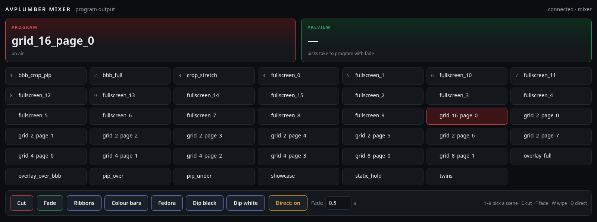
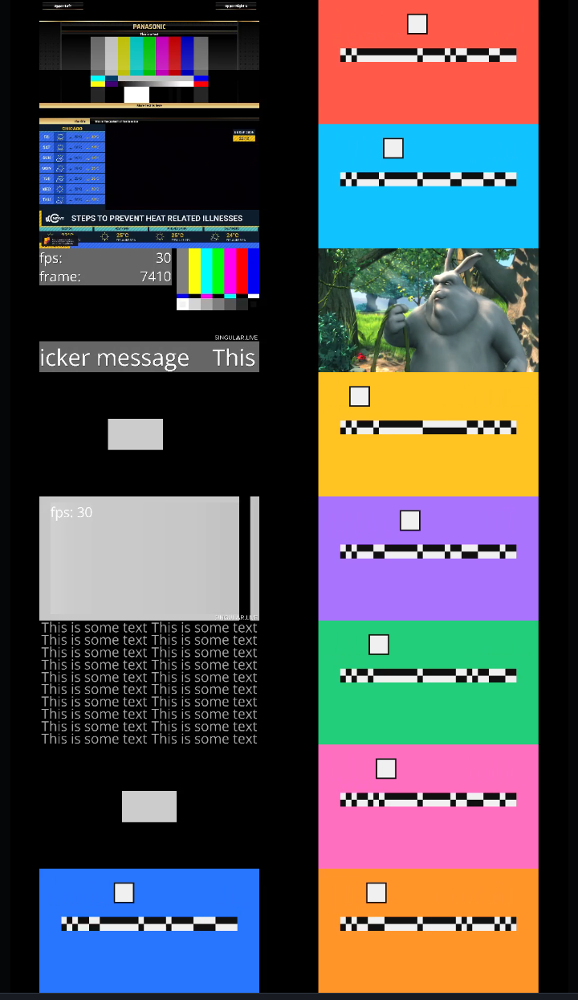

# Live mixer demo

<table>
<tr>
<td width="74%" valign="top"></td>
<td width="26%" valign="top"></td>
</tr>
</table>

Mix up to **64 independent video and browser sources** on one GPU canvas.
A JSON recipe chooses their proportions, the scene count and frame rate.
The control page places scene buttons beside the live program.

[**Watch it run** (21 s)](https://github.com/amagimedia/avplumber/releases/download/mixer-demo-media-2026-09/mixer-webui-demo.mp4) ·
[Demo page](https://amagimedia.github.io/avplumber/demos/mixer/docs/) ·
[Configuration reference](docs/config.md) ·
[Processing graph](https://amagimedia.github.io/avplumber/demos/graph.html?demo=mixer)

The recorded 16-source example on a Tesla T4 costs **17–18% GPU** with the canvas at 30 fps and
sends **2.86 Mbit/s** from a 2 700 kbit/s WebRTC rendition, with five media
wipes held decoded in GPU memory.

## Run

Use a Linux NVIDIA host with hardware decode, NVENC and `/dev/dri` browser
capture support. Follow the [Docker/NVIDIA setup](../README.md#nvidia-host-setup),
including the recursive submodule checkout. Run from the repository root:

```sh
mkdir -p media
cp demos/mixer/demo.equal.json media/demo.json
docker compose -f demos/mixer/compose.yaml up --build
```

Open **<http://127.0.0.1:7681>** for controls and HDR playback. Choose **SDR**
in the player if your browser cannot decode HEVC. The standalone player remains
at <http://127.0.0.1:8080>.

The first run builds the runtime, generates synthetic clips and a wipe, and
downloads the short public Bunny clip. It then starts 16 independent sources
and 32 scenes on a **1080×1920p60 HLG** canvas. Both Janus mountpoints and browser
capture are included; no private assets or host Python packages are needed.
Later starts reuse `media/assets/` and `media/media_wipes/`.

On a remote host, prefix the Compose command with `JANUS_HOST_IP=<host>` and
open `http://<host>:7681`. Allow TCP 7681/8080 and UDP 20000–20100. For large
grids, apply the [Janus socket-buffer settings](../../docker-compose/README.md#rtp-burst-headroom)
before starting the stack. Stop it with
`docker compose -f demos/mixer/compose.yaml down`; the media cache stays on disk.

## Choose a recipe

Copy either preset to `media/demo.json`:

| Preset | Source proportions |
| --- | --- |
| [`demo.equal.json`](demo.equal.json) | Equal weights for generated SDR 420, HLG 420, HLG 422, SDR 422, Bunny and browser sources. |
| [`demo.cinematic.json`](demo.cinematic.json) | The same categories, with two generated HLG 420 inputs replaced by public PQ and HLG movie clips at the default count. |

Edit that copy to make your own preset; no registration or Python changes are needed:

| Field | Examples |
| --- | --- |
| `source_count` | 8, 16, 32, 42, 54, 64 independent input chains |
| `scene_count` | 16, 32, 64 scene definitions |
| `canvas.fps` | 25, 30, 50, 60 |
| `inputs[].weight` | Relative source proportions; zero disables an entry |
| `layouts` | Relative scene proportions; enable `grid_32` or `grid_64` for larger grids |

Apply edits with `docker compose -f demos/mixer/compose.yaml restart mixer`.
The mixer prepares missing assets and prints the allocated source counts before
starting. Edit **`media/demo.json`**; `media/mixer.demo.json` is generated and
overwritten on startup. Independent inputs may read the same cached clip.

Both mixed presets use steady bars behind transparent overlays. For a run with
no media downloads, copy `demo.example.json` instead; it uses synthetic sources
only. See the [recipe reference](docs/recipe.md) for custom proportions, asset
URLs and preparation without Compose.

## Faster cuts and latency

Compose already prewarms cuts across the generated scenes. For a standalone
run with fixed, filter-free scenes, append:

```sh
--prewarm-cut-scene '*' --cut-latency-encoder janus_encoder
```

Prewarm retains recent decoded source frames for direct cuts, sharing bounded
queues across scene definitions without rendering every hidden scene. It is
off by default; repeat `--prewarm-cut-scene SCENE` to select only some scenes.
The cost is extra queue handling and potentially more retained GPU surfaces.

The demo uses three-slot graph queues; requesting four would round up to seven.
These queues are separate from the mixer's two-frame jitter tolerance and the
decoder's reference buffers. Scene definitions share source frames, so adding
scenes does not create more decoders. For large source counts, use media encoded
at the intended input resolution and frame rate: pacing a 60 fps file to 30 fps
after decoding still decodes all 60 frames per second.

The preview can show **avplumber latency** beside **WebRTC RTT**, outside the
video. The AVP value is the median of the last up to three measured CUTs, from
command receipt to the first matching encoded frame—not capture-to-browser
latency. See [measurement setup and prewarm limits](../../doc/mixer_cut_latency.md)
for the WebUI connection and deployment-local `metrics.json` configuration.

## Control it

The web page puts scene controls on the left and the portrait WebRTC player on
the right. Drag the divider to resize the panes; the split persists in your
browser. The player uses port 8080 on the same host and defaults to H.265/HDR;
open the control page with `?codec=h264` for SDR. If you change
`JANUS_PREVIEW_PORT`, pass that port as `?preview_port=8084` on the control page.
The standalone preview includes the latency and RTT readouts.

Two surfaces speak the same protocol and can run at once. Cut is the default
transition; explicit show settings and operator choices can select Fade or Wipe.

```sh
# browser: scene tiles, a button per wipe clip, Cut / Fade / Direct
python3 demos/mixer/webui.py --host 127.0.0.1 --port 7777 --http-port 7681

# terminal
python3 -m venv .venv-tui && .venv-tui/bin/python -m pip install -r demos/mixer/requirements.txt
.venv-tui/bin/python demos/mixer/tui.py --host 127.0.0.1 --port 7777
```

| Control | Result |
| --- | --- |
| A scene tile | Loads Preview; in Direct mode, takes it to Program |
| Cut / `c` | Immediate take |
| Fade / `f` | Blend over the chosen duration |
| A wipe button / `w` | Play that transparent clip over the change |
| Direct / `d` (`t` in the TUI) | Picks go straight to Program |
| `1`–`9` | Pick one of the first nine scenes |

A new take interrupts a running transition from the current picture. Wipes
decode on each take by default; decoded clips are not retained in GPU memory.
Use `--wipe-cache-mb 256` to opt into a GPU cache with a 256 MiB budget.
The recipe generates a diagonal sweep and sliding panels with moving colour
bands at the selected FPS. No external wipe files are needed. Custom clips
must preserve alpha (for example QTRLE/ARGB or ProRes 4444) and cover the
canvas at their midpoint to hide the scene switch.

## Browser pages as sources

Recipe entries with `kind: "browser"` open their own DMA-BUF windows. Pages and
files share every layout and transition; a page that stops painting holds its
last frame. The included alpha page needs no external website.

The stack allows 16 browser windows across two processes. This covers both
presets even at 64 total sources. For a custom mix with more browsers, set
`MIXER_BROWSER_CAPACITY` when starting Compose. This is browser capacity, not
the recipe's total source count. Lower-level browser-only setup remains in the
[DMA-BUF demo](../dmabuf-browser/README.md).

## Describe a show in one file

`--config mixer.json` replaces `--input` and the built-in layouts with a
document of sources, scenes, wipes, control defaults and encoded outputs — no
2/4/8/16-box layout lives in code. Every field is documented in
**[docs/config.md](docs/config.md)**; [`config.example.json`](config.example.json)
is a worked example.

The example uses placeholder locations. Supply your own source IDs, URLs, media
paths and scenes in a deployment configuration kept outside the public checkout.
The running show's source list is not a mixer default.

```sh
docker run ... avplumber-mixer:local --config /media/mixer.json --janus-output
```

`make_config.py` writes the demo's own layouts out in that form:

```sh
python3 demos/mixer/make_config.py --wipe /media/wipe.mov \
  cam1=/media/camera-1.mp4 page=https://example.org/page@1920x1080 > mixer.json
```

## Test sources

Sixteen generated clips with visible frame IDs (needs NumPy and FFmpeg):

```sh
python3 demos/mixer/tests/frame_codes.py media --sources 16 --width 1920 --height 1080 --fps 60 --seconds 30
```

Eight colorful SDR patterns (bars, mandelbrot, life, ...) as NVENC clips:

```sh
python3 demos/mixer/tests/sdr_patterns.py media/assets/patterns --fps 60 --seconds 20
```

## Under the hood

Janus output limits forced keyframes to one per 150 ms by default (9 frames at
60 fps). Override with `--keyframe-min-interval-ms 200`; `0` disables the limit.
The option also applies to Janus renditions loaded with `--config`. Cuts and
ordinary frames are not delayed: pending cut/RTCP requests coalesce until the
next eligible frame. Periodic keyframes share the same limit.

<a href="https://amagimedia.github.io/avplumber/demos/graph.html?demo=mixer" target="_blank" rel="noopener noreferrer"></a>

Two compositor slots draw every scene; a transition filter blends them and the
wipe is one more layer in the same kernel, so nothing round-trips through the
CPU. Browser frames are converted from RGB to the NV12, P010 or P210 canvas inside the
draw pass. The program is composited once and each rendition re-times and rescales
it, so a second output costs an encode, not another composite.

Limits: 64 sources per show, no runtime source changes. Recipe grids support up
to 64 boxes; the legacy `--input` layouts support up to 16;
see [docs/config.md](docs/config.md#known-limitations).

Output files, Janus settings, layouts and tests: [docs/guide.md](docs/guide.md).
Measured samples and conditions: [runtime-load-1080p.json](docs/runtime-load-1080p.json),
[latency.md](docs/latency.md).
