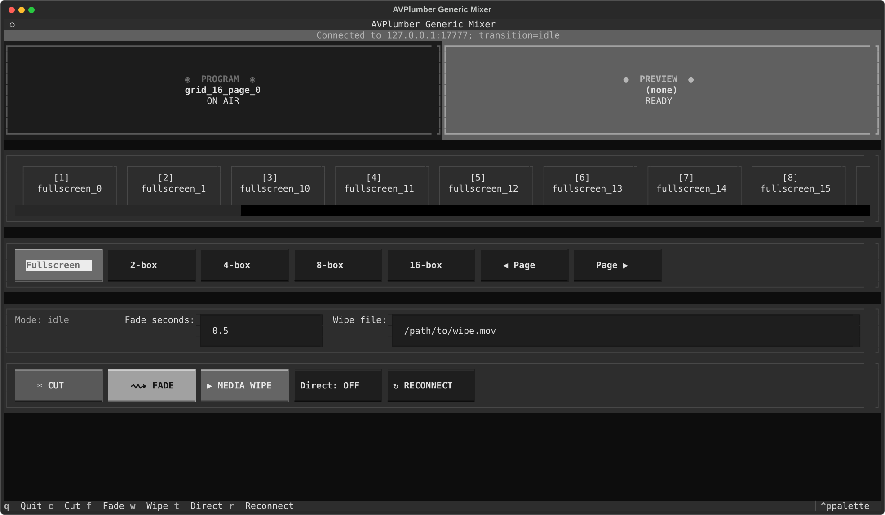

# Generic manual mixer demo



## Features

This demo manually mixes any positive number of video inputs into one
1080x1920 portrait program. It provides a separate terminal interface for
choosing what is on air, preparing the next view, and changing between views.

The interface provides:

- separate **Program** (on-air) and **Preview** (ready) buses;
- a scrollable strip of fullscreen and grid scenes;
- fullscreen and paged 2-box, 4-box, 8-box, and 16-box layouts;
- immediate Cut, timed Fade, and GPU-native CUDA Wipe transitions;
- left, right, up, and down wipe styles;
- editable transition duration and wipe style;
- Direct mode for putting scene and layout selections straight on air; and
- connection status, transition status, and manual Reconnect.

With Direct mode off, selecting a scene or layout loads it into Preview. Cut,
Fade, and CUDA Wipe wait until that preheated Preview scene is ready before
sending the transition. With Direct mode on, scene and layout selections cut
directly to Program.

Input order determines source numbers. A disconnected or incomplete input keeps
its assigned position and displays black; remaining inputs never shift to fill
the gap. Empty cells on the last grid page are also black.

This is deliberately a video-only manual mixer. It has no audio, speaker
detection, automatic switching, face analysis, or source-specific policy.

### Keyboard controls

| Key | Action |
| --- | --- |
| `1`-`9` | Select one of the first nine scenes; Preview normally, Program in Direct mode |
| F1-F9 | Cut one of the first nine scenes directly to Program |
| `c` | Cut |
| `f` | Fade |
| `w` | CUDA Wipe |
| `t` | Toggle Direct mode |
| `r` | Reconnect |
| `q` | Quit |

Keyboard scene shortcuts are ignored while a transition-duration or wipe-style
field has focus, so numbers and text can be entered normally.

## Requirements

The mixer backend requires:

- an NVIDIA host;
- AVPlumber and `pyplumber` built with matching CUDA and NVCC support;
- the same FFmpeg installation for the binary and Python module;
- FFmpeg with the patched CUDA overlay and transition filters; and
- at least one video input and one output.

The graph accepts only an NVENC encoder and keeps frames on the GPU from decode
through output. There is no software-encoder fallback or CPU
`hwdownload`/`hwupload` path.

The control TUI requires Textual but may run in a separate terminal or on
another host that can reach the backend's TCP control port:

```sh
python3 -m pip install -r demos/mixer/requirements.txt
```

## Start the mixer backend

Repeat `--input` for every media file or network URL. At least one of
`--output` and `--janus-output` is required:

```sh
LD_LIBRARY_PATH=/usr/local/lib python3 demos/mixer/mixer.py \
  --input <input-1> \
  --input <input-2> \
  --output <output-url-or-path> \
  --remote-control-port 7777
```

Use `--loop-inputs` to repeat finite files. Each file is paced from its own
timestamps, so input decoding must keep up in real time.

The default frame rate is 30 fps. `--fps` controls input normalization, mixer
timing, GOP length, and every enabled output:

```sh
python3 demos/mixer/mixer.py \
  --input <input-1> \
  --input <input-2> \
  --loop-inputs \
  --output program.mp4 \
  --fps 60
```

Use 60 fps only when the NVIDIA host can decode all inputs in real time.
`--preheat-timeout` controls how long startup waits for every required source
and transition path; its default is 60 seconds.

Output format is inferred for RTMP, SRT, `.flv`, `.ts`, `.mp4`, `.mkv`, and
`.webm`. Pass `--output-format` when the target is ambiguous. The default
recording/stream encoder is `h264_nvenc` at `8M`; another `*_nvenc` codec and
bitrate may be selected with `--codec` and `--bitrate`.

Run `python3 demos/mixer/mixer.py --help` for the complete backend option list.

## Start the control TUI

In another terminal, connect to the backend's control port:

```sh
python3 demos/mixer/tui.py \
  --host 127.0.0.1 \
  --port 7777 \
  --wipe-style wipe_left
```

The defaults are mixer name `mixer`, Fade/Wipe duration `0.5` seconds, and wipe
style `wipe_left`. Use `--mixer`, `--fade-duration`, and `--wipe-style` to
change them. Supported styles are `wipe_left`, `wipe_right`, `wipe_down`, and
`wipe_up`.

The TUI polls Program, Preview, and transition state twice per second. If the
connection fails or is lost, it shows the error in the connection bar; use
**RECONNECT** or press `r` after the backend becomes reachable.

## Janus output

`--janus-output` publishes the video-only Program as H.264 RTP. It may be used
alone or together with `--output`:

```sh
LD_LIBRARY_PATH=/usr/local/lib python3 demos/mixer/mixer.py \
  --input <input-1> \
  --input <input-2> \
  --loop-inputs \
  --janus-output \
  --remote-control-port 7777
```

Create the video-only Janus Streaming mountpoint before starting the mixer. The
demo does not create or destroy it through the Janus API.

| Setting | Default | Option |
| --- | --- | --- |
| RTP destination | `127.0.0.1:5004` | `--janus-host`, `--janus-video-port` |
| RTCP destination | `127.0.0.1:5005` | follows the video RTP port |
| RTP payload type | `96` | `--janus-video-pt` |
| SSRC | `0x41565001` | `--janus-video-ssrc` |
| bitrate | 3000 kbit/s | `--janus-video-bitrate-kbps` |
| local RTCP listener | `0.0.0.0` on an automatic port | `--janus-rtcp-bind`, `--janus-rtcp-port` |

The mixer sends RTCP sender announcements and listens for PLI/FIR feedback;
either feedback request forces an immediate keyframe.

## Layouts

Every scene uses a 1080x1920 portrait canvas:

| View | Columns | Rows | Cell size |
| --- | ---: | ---: | ---: |
| Fullscreen | 1 | 1 | 1080x1920 |
| 2-box | 1 | 2 | 1080x960 |
| 4-box | 1 | 4 | 1080x480 |
| 8-box | 2 | 4 | 540x480 |
| 16-box | 2 | 8 | 540x240 |

Inputs retain their aspect ratio and are centered on black within each cell.
When there are more inputs than cells, **Page** moves between consecutive
groups without reordering sources.

## Docker

The demo image builds FFmpeg 7.1 with `deps/ffmpeg-patches`, verifies the
patched CUDA overlay and transition filters, and builds the CUDA-enabled
AVPlumber Python module against that FFmpeg installation:

```sh
docker build -f demos/mixer/Dockerfile -t avplumber-mixer:local .

docker run --rm --gpus all --network host \
  -v <path-to-media>:/media:ro \
  avplumber-mixer:local \
  --input /media/camera-1.mp4 \
  --input /media/camera-2.mp4 \
  --loop-inputs \
  --janus-output
```

Host networking exposes the RTP/RTCP and TCP control paths in the same way as
the other Janus demos. Input paths are supplied at runtime; the image contains
no media locations or endpoints.

Start `demos/mixer/tui.py` separately and connect it to port 7777.

## Tests

Pure layout, graph-construction, control, and TUI tests do not require a GPU:

```sh
python3 -m pytest -q demos/mixer/tests
```

With the mixer backend running, the protocol smoke test exercises the required
scenes and reports transition-command and settle latency:

```sh
python3 demos/mixer/smoke_test.py --port 7777
```

The runtime acceptance check requires the configured NVIDIA environment. It
must cover every layout, a disconnected input, Preview plus Cut/Fade/all four
CUDA wipes, and the deterministic `overlay_many_cuda` matrix in
`demos/cuda-overlay`.

## Implementation notes

The video-frame pipeline is zero-copy CUDA from hardware decode through NVENC.
Every supported geometry is created at startup. A `preheat_video_router` feeds
fixed `scale_cuda` and `pad_cuda` graphs for both mixer slots, preserving aspect
ratio and adding black padding where required.

Both `cuda_rect_overlay` compositors and the permanent `transition_cuda` filter
are warmed before the control server reports ready. Cut, Fade, and left/right/
up/down Wipe therefore change runtime parameters without rebuilding an FFmpeg
filter graph.
