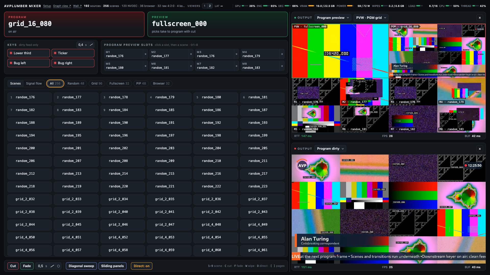
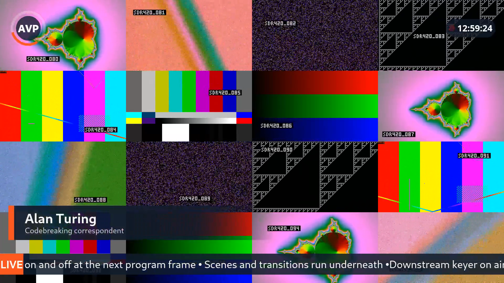

# Live mixer demo

<table>
<tr>
<td width="74%" valign="top"></td>
<td width="26%" valign="top"></td>
</tr>
</table>

Mix independent video and browser sources on one GPU canvas.
A JSON recipe chooses their proportions, the scene count and frame rate.
The control page places scene buttons beside the live program.

[**Watch it run** (30 s)](https://github.com/amagimedia/avplumber/releases/download/mixer-demo-media-2026-09/mixer-webui-demo.mp4) ·
[Demo page](https://amagimedia.github.io/avplumber/demos/mixer/docs/) ·
[Configuration reference](docs/config.md) ·
[Processing graph](https://amagimedia.github.io/avplumber/demos/graph.html?demo=mixer)

The recorded 16-source example on a Tesla T4 costs **17–18% GPU** with the canvas at 30 fps and
sends **2.86 Mbit/s** from a 2 700 kbit/s WebRTC rendition, with five media
wipes held decoded in GPU memory.

## Run

Use a Linux NVIDIA host with hardware decode, NVENC and `/dev/dri` browser
capture support. Follow the [Docker/NVIDIA setup](../README.md#nvidia-host-setup),
including the recursive submodule checkout. Run from the repository root:

```sh
docker compose -f demos/mixer/compose.yaml up --build
```

The mixer image builds on Fedora 44 with CUDA 13.4 and needs host driver R615 or
newer; the container runtime refuses an older host at start (`unsatisfied
condition: cuda>=13.4`). On such a host select the Ubuntu 22.04 / CUDA 11.7 image
instead, with the same variable on every later `up --build`:

```sh
MIXER_DOCKERFILE=Dockerfile docker compose -f demos/mixer/compose.yaml up --build
```

Both are described in the [guide's Docker section](docs/guide.md#docker).

Open **<http://127.0.0.1:7681/setup/>**, choose orientation, FPS, unique sources,
scenes, mode and source counts, then click **Apply setup**. The instance generates
its assets and starts the mixer. No JSON editing or downloads are required.
**8-bit** uses an SDR NV12 canvas and H.264 output only; the player hides its
stream selector. **10-bit HDR** offers **4:2:2** (P210, default) or **4:2:0**
(P010), with H.264 SDR and H.265 HDR outputs. Switching to HDR splits the
existing NVDEC count between SDR and HDR; browser and raw-upload counts are
preserved. Each source type has an editable count. Editing a type updates the
total; changing the total redistributes the current mix. HDR 4:2:2 inputs are
capped at **four**, redistributing the remainder among the other enabled types.
4:2:0 mode excludes 4:2:2 inputs. Switching to SDR reallocates video weights to
SDR 4:2:0; 8-bit 4:2:2 is not offered.

The same page changes an existing instance: it prepares missing assets, restarts
the mixer, then refreshes the control page and player. Output pauses during the
restart. If startup fails, the service attempts to restore the previous show.

**Restarts.** A stop asks every input group at once, so even a large show stops in
seconds. The web UI process stops its mixer cleanly on `docker compose stop` or
`restart` (90 s grace), which releases browser frames instead of forcing a
browser-worker restart. If the mixer exits on its own (a crash, or a node panic
that shuts the graph down), the setup page shows the exit and restarts the same
show after 2, 5, 15, then 60 s; a run of 5 minutes resets that sequence, and
**Apply setup** restarts at once. Multiview tile assignments are saved as they
change, so a restart shows the same tiles. The container log times every phase
(`Stopping mixer`, `Assets ready`, `Browser workers recovered`, `Graph built`,
`Inputs ready`, `Mixer ready: … in N s`).

Open **<http://127.0.0.1:7681>** for controls and HDR playback. Choose **SDR**
in the player if your browser cannot decode HEVC. The standalone player remains
at <http://127.0.0.1:8080>.

The player also shows host GPU/NVDEC usage and used/total VRAM from `nvidia-smi`,
sampled once per second. Usage turns orange at 95% and red at 99%; VRAM turns
orange at 14 GiB and red at 14.75 GiB. These totals include other GPU applications.

The setup limits unique sources to **110 at 25 and 30 fps, 90 at 50 and 75 at
60 fps**, set on a 16 GiB NVIDIA T4 host, where 110 at 30 fps and 75 at 60 fps are
the measured baselines; 25 fps inherits the 30 fps total (validated to 100) and
50 fps scales the 60 fps one by frame rate. Downstream-key pages count as sources: each key takes one place in that
budget. It allows at most **40 browser windows** (sources and key pages together;
the browser service runs five workers with eight windows each) and **192
scenes**. Source mix, orientation and bit depth also affect capacity; a
mixed-source budget does not mean the GPU can decode that many simultaneous
videos. Combined SDR/HDR NVDEC inputs are capped at about 1 100 decoded frames
per second: **40 at 25 fps, 36 at 30, 22 at 50 and 18 at 60**. Raw uploads share
**30/34/20/17** units at 25/30/50/60 fps: an SDR NV12 source uses one unit and
an HDR P010 source uses two. The **HDR · 4:2:0 · raw upload** count is available
in both 10-bit modes and uses no NVDEC. See the
[capacity measurements](docs/capacity.md) for tested mixes and limitations.

Settings persist in `media/demo.json`; later starts restore them and reuse
`media/assets/` and `media/media_wipes/`. The HTTP server stays running while its
mixer child restarts, without access to the Docker socket. The generic setup
includes generated clips and two moving alpha wipes, with no media downloads.
Custom files and explicit scene geometry remain advanced recipe options below.

On a remote host, prefix the Compose command with `JANUS_HOST_IP=<host>` and
open `http://<host>:7681`. Allow TCP 7681/8080 and UDP 20000–20100. For large
grids, apply the [Janus socket-buffer settings](../../docker-compose/README.md#rtp-burst-headroom)
before starting the stack. Stop it with
`docker compose -f demos/mixer/compose.yaml down`; the media cache stays on disk.

## Choose a recipe

Start with generic media, then optionally choose a mixed-source preset:

| Preset | Source proportions |
| --- | --- |
| [`demo.example.json`](demo.example.json) | Generated SDR/HLG 420/422 sources only, plus generated wipes. No media downloads. |
| [`demo.equal.json`](demo.equal.json) | Equal weights for generated SDR 420, HLG 420, HLG 422, SDR 422 and browser sources. |

Copy a preset to the media directory, then edit it; no registration or Python changes are needed:

```sh
mkdir -p media
cp demos/mixer/demo.equal.json media/demo.json
```

| Field | Examples |
| --- | --- |
| `source_count` | 8, 16, 32, 42, 64, 96 independent input chains |
| `scene_count` | 16, 32, 64 scene definitions |
| `canvas.fps` | 25, 30, 50, 60 |
| `inputs[].weight` | Relative source proportions; zero disables an entry |
| `layouts` | Relative scene proportions; enable `grid_32` or `grid_64` for larger grids |

Apply edits with `docker compose -f demos/mixer/compose.yaml restart mixer`.
The mixer prepares missing assets and prints the allocated source counts before
starting. Edit **`media/demo.json`**; `media/mixer.demo.json` is generated and
overwritten on startup. Every generated source has its own clip, its ID burned in.

`demo.equal.json` uses steady bars behind transparent overlays. For a run
without browsers, copy `demo.example.json` instead; it uses synthetic sources
only. See the [recipe reference](docs/recipe.md) for custom proportions, asset
URLs and preparation without Compose.

## Faster cuts and latency

Compose already prewarms cuts across the generated scenes. For a standalone
run with fixed, filter-free scenes, append:

```sh
--prewarm-cut-scene '*' --cut-latency-encoder janus_encoder
```

Prewarm retains recent decoded source frames for direct cuts, sharing bounded
queues across scene definitions without rendering every hidden scene. It is
off by default; repeat `--prewarm-cut-scene SCENE` to select only some scenes.
The cost is extra queue handling and potentially more retained GPU surfaces.

The demo uses three-slot graph queues; requesting four would round up to seven.
These queues are separate from the mixer's playout deadline (two frames at 25/30
fps, three at 50/60) and the decoder's reference buffers. Scene definitions share
source frames, so adding scenes does not create more decoders. For large source
counts, use media encoded at the intended input resolution and frame rate: pacing
a 60 fps file to 30 fps after decoding still decodes all 60 frames per second.

The preview can show **Graph latency** beside **WebRTC RTT**, outside the
video. The AVP value is the median of the last up to three measured CUTs, from
command receipt to the first matching encoded frame—not capture-to-browser
latency. See [measurement setup and prewarm limits](../../doc/mixer_cut_latency.md)
for the WebUI connection and deployment-local `metrics.json` configuration.

## Control it

The web page puts scene controls on the left and the portrait WebRTC player on
the right. Drag the divider to resize the panes; the split persists in your
browser. The player loads from port 8080 on the same host and defaults to
H.265/HDR; open the control page with `?codec=h264` for SDR. If you change
`JANUS_PREVIEW_PORT`, pass that port as `?preview_port=8084` on the control page;
behind a reverse proxy, point the page at a path of its own origin with
`--preview-base` ([below](#behind-a-reverse-proxy)).
The standalone preview includes the latency and RTT readouts. Every viewer the
control page opens, program and multiviews, plays with the same receiver
playout delay: the browser's adaptive jitter buffer by default, or, with
`?lowlat=1` on the control page, the player's `?lowlat=1` for all of them, the
buffer pinned to its minimum (`jitterBufferTarget` and `playoutDelayHint` 0)
so a cut shows in the program and in the multiview's PVW tile at the same
instant instead of each stream settling on its own delay. The pin stays opt-in,
as on the player: it gains 4–5 ms on a clean link and removes the cushion on a
link that loses packets, and a software HEVC decoder drops late frames while
the program viewport defaults to H.265 wherever the browser plays it; try it
with `?codec=h264` first.

Two surfaces speak the same protocol and can run at once. Cut is the default
transition; explicit show settings and operator choices can select Fade or Wipe.

```sh
# browser: scene tiles, a button per wipe clip, Cut / Fade / Direct
python3 demos/mixer/webui.py --host 127.0.0.1 --port 7777 --http-port 7681

# terminal
python3 -m venv .venv-tui && .venv-tui/bin/python -m pip install -r demos/mixer/requirements.txt
.venv-tui/bin/python demos/mixer/tui.py --host 127.0.0.1 --port 7777
```

| Control | Result |
| --- | --- |
| A scene tile | Loads Preview; in Direct mode, takes it to Program |
| Cut / `c` | Immediate take |
| Fade / `f` | Mix over the chosen duration, or dip through a colour picked beside the fade curve |
| A wipe button / `w` | Play that transparent clip over the change |
| Direct / `d` (`t` in the TUI) | Picks go straight to Program |
| `1`–`9` | Pick one of the first nine scenes |

A new take interrupts a running transition from the current picture. Decoded wipe
clips are held in GPU memory: the cache budget is 640 MiB by default (the generic
setup's two wipes take about 0.5 GB) and the web UI's WIPES meter shows its fill.
`--wipe-cache-mb 0` decodes each take instead. The recipe generates a diagonal
sweep and sliding panels with moving colour bands at the selected FPS. No
external wipe files are needed. Custom clips must preserve alpha (for example
QTRLE/ARGB or ProRes 4444) and cover the canvas at their midpoint to hide the
scene switch.

## Behind a reverse proxy

The control page on port 7681 and the player on port 8080 are two origins, so a
proxy that protects both with HTTP basic auth asks for the password twice. Serve
them from one origin instead: the page at `/` and the preview server under
`/preview/` with the prefix stripped, and tell the page where the player is:

```nginx
auth_basic "mixer";
auth_basic_user_file <htpasswd-file>;
location /         { proxy_pass http://127.0.0.1:7681; }
location /preview/ { proxy_pass http://127.0.0.1:8080/; }   # the trailing slash strips the prefix
```

```sh
python3 demos/mixer/webui.py --preview-base /preview/      # Compose: MIXER_PREVIEW_BASE=/preview/
```

Every player the page opens (the program in each codec, the clean output and
the multiviewers, and the "open in the player" links) then loads from
`/preview/`, and the player reaches Janus and posts its receiver stats under
that path (`/preview/janus`, `/preview/receiver-stats`), so one realm covers
everything. Rewriting the page in the proxy (`sub_filter`) is not needed, and
forwarding `/janus` or `/receiver-stats` at the root is no longer required. The
base must end with a slash, which `--preview-base` adds; a URL on another host
is accepted too, and `?preview_port=` still replaces the port.

## Browser pages as sources

Recipe entries with `kind: "browser"` open their own Chromium windows (Electron 44 /
Chromium 152) whose DMA-BUFs are imported zero-copy into CUDA. Pages and
files share every layout and transition; a page that stops painting holds its
last frame. The included alpha page needs no external website; like a real
graphic it rests most of the time and animates a third of it.

The stack allows 40 browser windows across five processes, eight per process.
Set `MIXER_BROWSER_CAPACITY` when starting Compose to change the service capacity.
The generic setup page caps browser inputs at 40, downstream-key pages included.
This is browser capacity, not the recipe's total source count. Lower-level
browser-only setup remains in the [DMA-BUF demo](../dmabuf-browser/README.md).

## Describe a show in one file

`--config mixer.json` replaces `--input` and the built-in layouts with a
document of sources, scenes, wipes, control defaults and encoded outputs — no
2/4/8/16-box layout lives in code. Every field is documented in
**[docs/config.md](docs/config.md)**; [`config.example.json`](config.example.json)
is a worked example.

The example uses placeholder locations. Supply your own source IDs, URLs, media
paths and scenes in a deployment configuration kept outside the public checkout.
The running show's source list is not a mixer default.

```sh
docker run ... avplumber-mixer:local --config /media/mixer.json --janus-output
```

`make_config.py` writes the demo's own layouts out in that form:

```sh
python3 demos/mixer/make_config.py --wipe /media/wipe.mov \
  cam1=/media/camera-1.mp4 page=https://example.org/page@1920x1080 > mixer.json
```

## Test sources

Sixteen generated clips with visible frame IDs (needs NumPy and FFmpeg):

```sh
python3 demos/mixer/tests/frame_codes.py media --sources 16 --width 1920 --height 1080 --fps 60 --seconds 30
```

Eight colorful SDR patterns (bars, mandelbrot, life, ...) as NVENC clips:

```sh
python3 demos/mixer/tests/sdr_patterns.py media/assets/patterns --fps 60 --seconds 20
```

## Under the hood

Janus output limits forced keyframes to one per 150 ms by default (9 frames at
60 fps). Override with `--keyframe-min-interval-ms 200`; `0` disables the limit.
The option also applies to Janus renditions loaded with `--config`. Cuts and
ordinary frames are not delayed: pending cut/RTCP requests coalesce until the
next eligible frame. Periodic keyframes share the same limit.

<a href="https://amagimedia.github.io/avplumber/demos/graph.html?demo=mixer" target="_blank" rel="noopener noreferrer"></a>

Two compositor slots draw every scene; a transition filter blends them and the
wipe is one more layer in the same kernel, so nothing round-trips through the
CPU. Browser frames are converted from RGB to the NV12, P010 or P210 canvas inside the
draw pass. The program is composited once and each rendition re-times and rescales
it, so a second output costs an encode, not another composite.

Limits: 128 sources per show (127 with an aux output), no runtime source
changes. Recipe grids support up to 64 boxes; the legacy `--input` layouts
support up to 16; see [docs/config.md](docs/config.md#known-limitations).

Output files, Janus settings, layouts and tests: [docs/guide.md](docs/guide.md).
Measured samples and conditions: [runtime-load-1080p.json](docs/runtime-load-1080p.json),
[latency.md](docs/latency.md).
