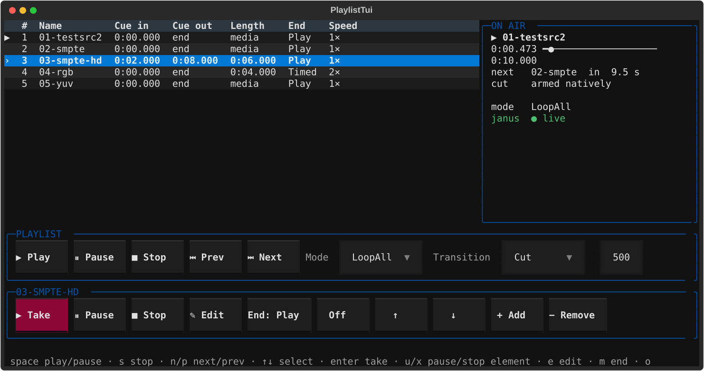
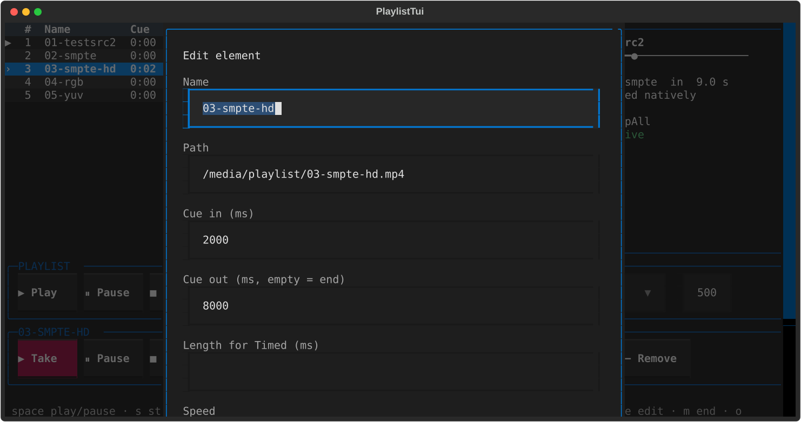

# Playlist demo





## Features

This demo plays a list of video clips through AVPlumber and sends one video-only
H.264 RTP stream to an existing Janus Streaming mountpoint. It is a regression
harness for playlist behavior, not a production playlist service.

The interface provides:

- playlist Play, Pause, Stop, Previous, and Next controls;
- separate Play, Pause, and Stop controls for the highlighted item;
- four playlist modes and three per-item completion modes;
- editable media path, display name, cue-in, cue-out, duration, and speed;
- controls to add, remove, enable, disable, and reorder items; and
- visible playlist, selected-item, active-item, loading, Janus-output, and error
  state.

Highlighting a row selects it for item operations but does not switch the
output. Use **ITEM PLAY** to put the highlighted item on air. Playlist Play
resumes the active item or, if nothing has been activated yet, starts the first
enabled item.

### Playback modes

Playlist and item modes are independent:

| Mode | What happens when an item completes |
| --- | --- |
| `PlayAll` | Play the next enabled item, then stop after the last one. |
| `PlayCurrent` | Stop after the current item. |
| `LoopAll` | Play all enabled items repeatedly. |
| `LoopCurrent` | Repeat the current item. |
| `PlayToEnd` | Complete the item at its cue-out or natural end. |
| `Timed` | Complete the item after its configured playing time. |
| `LoopSelf` | Repeat this item until the user navigates away from it. |

Manual Previous and Next navigation can leave a current-only or `LoopSelf`
item. Disabled items are skipped.

### Keyboard controls

The shortcuts are intentionally hidden in the TUI and call the same actions as
the buttons:

| Key | Action |
| --- | --- |
| Space | Playlist Play/Pause |
| `s` | Playlist Stop |
| `n` / `p` | Next / Previous |
| Enter | Play highlighted item |
| `u` / `x` | Pause / Stop highlighted item |
| `m` | Cycle highlighted item's mode |
| `e` | Enable or disable highlighted item |
| `a` / Delete | Add / remove item |
| `1` / `2` / `3` / `4` | `PlayAll` / `PlayCurrent` / `LoopAll` / `LoopCurrent` |
| `q` | Quit |

## Preview without AVPlumber, CUDA, or Janus

Install the Textual dependency and run the in-memory UI:

```sh
python3 -m pip install -r demos/playlist/requirements.txt
python3 demos/playlist/player.py --dry-run
```

The controls work against a fake backend, but no video is decoded or sent.

## Run with video output

### Requirements

The live demo requires:

- an NVIDIA host;
- a CUDA-enabled AVPlumber binary and a `pyplumber` module built with the same
  CUDA, NVCC, neural, and TensorRT feature set;
- matching FFmpeg libraries with CUDA decoding and `h264_nvenc`; and
- an existing, video-only Janus Streaming mountpoint that accepts H.264 RTP.

There is no software-decoding fallback, audio output, or CPU
`hwdownload`/`hwupload` path.

### Prepare the five demo clips

```sh
demos/playlist/test-media/generate.sh
```

The generator creates five distinct H.264 clips under
`demos/playlist/test-media/`. Each clip is 1920x1080, 30 fps, 300 frames, and
ten seconds long. Its picture shows the clip label, zero-based frame number,
and PTS clock. The generated MP4 files are ignored build artifacts; the script
is the fixture definition.

### Start the player

```sh
python3 demos/playlist/player.py \
  --janus-host 127.0.0.1 \
  --janus-video-port 5004 \
  --log-file playlist-demo.log
```

The default Janus settings are:

| Setting | Default | Option |
| --- | --- | --- |
| RTP destination | `127.0.0.1:5004` | `--janus-host`, `--janus-video-port` |
| RTP payload type | `96` | `--janus-video-pt` |
| SSRC | `0x41565001` | `--janus-video-ssrc` |
| local RTCP listener | `0.0.0.0` on an automatic port | `--janus-rtcp-bind`, `--janus-rtcp-port` |
| control timeout | 10 seconds | `--control-timeout` |

Janus receives RTCP on the port immediately after the video RTP port. The
player listens for PLI/FIR feedback and forces an encoder keyframe when Janus
requests one.

Use `--media-dir <path>` when the five generated filenames are in a different
directory. Use `--no-tui` for the short headless control smoke test. Run
`python3 demos/playlist/player.py --help` for the complete option list.

AVPlumber logs and native control replies go to `--log-file` while Textual owns
the terminal.

Per-item Pause and Stop are regression-only source-lifecycle controls. The
current gateway playlist API exposes item Play/select, cue, duration, disable,
remove, and reorder, while playlist Pause and Stop are media controls.

## Run in Docker

The playlist image generates and validates the five clips during the build. Its
base image must already contain the CUDA-enabled `pyplumber` module and matching
AVPlumber runtime:

```sh
export AVP_BASE_IMAGE=<cuda-python-avplumber-image>
docker build \
  --build-arg AVP_BASE_IMAGE="$AVP_BASE_IMAGE" \
  --tag avplumber-playlist:local \
  demos/playlist
```

Run it against Janus on the host network:

```sh
docker run --rm -it \
  --gpus all \
  --network host \
  avplumber-playlist:local
```

Recreating the container reuses the clips stored in the image. Rebuilding the
image reruns the deterministic generator. Append normal `player.py` options
after the image name to change the Janus configuration.

## Regression exercise

Run the full live acceptance sequence without the TUI:

```sh
python3 demos/playlist/regression.py \
  --janus-host 127.0.0.1 \
  --janus-video-port 5004 \
  --log-file playlist-regression.log
```

It prints one JSON result after shutdown. The exercise covers all playlist and
item modes; playlist and item transport; cue and speed edits; add, remove,
disable, and reorder; source failure; timed completion; native `LoopSelf`; and
natural EOF. It also checks that stopped switcher slots remain reusable and
that the permanent RTP output stays working throughout.

Observe the Janus mountpoint during the run to confirm that Pause and Stop
retain the last decoded frame and that Play resumes without recreating the
mountpoint. This live NVIDIA/Janus run is the acceptance gate; local tests do
not substitute for observing decoded Janus video.

## Tests

```sh
python3 -m pytest demos/playlist/tests -q
```

The local suite covers playlist policy, controller actions, graph shape,
asynchronous source handoff and failure, all visible Textual controls at an
80x24 terminal size, hidden keyboard bindings, and generated media validation
when the fixtures are present.

## Implementation notes

The demo uses existing AVPlumber nodes. Each loaded item owns a source group:

```text
input_rec -> demux -> CUDA decode -> speed_video -> force_fps
```

Up to sixteen fixed item edges feed the existing typed switcher and permanent
output graph:

```text
item_0_normalized ... item_15_normalized
    -> source_switcher<av::VideoFrame>
    -> realtime -> position probe
    -> force_keyframe -> h264_nvenc -> bsf -> mux -> Janus RTP
```

Before switching, the backend starts the requested source, waits for a decoded
frame, and only then selects it. A failed source therefore does not replace the
working source. Changed sources use new, uniquely named generations so stopped
node and team names are never reused unsafely.

URL, cue, mode, and speed edits rebuild only the affected source. Playlist and
item Stop leave the switcher, realtime node, encoder, mux, and RTP output
running. The source side becomes quiet, so a viewer normally retains its last
decoded frame; the demo does not synthesize frames during the pause.

The harness does not modify `source_switcher`, `force_fps`, sentinel, graph
management, or the control protocol. Its only associated framework-level
change is the Python binding call guard that releases the GIL during control
commands and group start/stop requests so readiness and EOF callbacks can run.
Blocking graph operations run on one serialized backend worker rather than the
TUI thread.
