## Prerequisite phase: export `player-seg` TensorRT engine

Training is already complete on the fedora T4 box; we need to produce the ONNX and the FP16 `.plan` artifacts so the pipeline can load the engine. All work is on `fedora@172.17.36.132` (ssh key per CLAUDE.md).

Runbook (all commands from an ssh session to the remote):

```bash
# 0) Activate env per doc/models.md
source /home/fedora/tensorrt/.venv/bin/activate

# 1) Discover the training run. Ultralytics auto-increments the run name;
#    list candidates so we pick the newest best.pt deterministically.
ls -lat /home/fedora/tensorrt/player-seg*/train*/weights/best.pt 2>/dev/null
ls -lat /home/fedora/tensorrt/*/player-seg*/weights/best.pt 2>/dev/null
# Pick the most recent match and export as PLAYER_SEG_PT; sanity-check with:
#   python -c "import torch,sys; m=torch.load(sys.argv[1],map_location='cpu'); print(m.get('model').yaml if hasattr(m.get('model'),'yaml') else 'no yaml')" "$PLAYER_SEG_PT"

# 2) Export to ONNX at 960x544 (imgsz is height,width)
yolo export model="$PLAYER_SEG_PT" format=onnx imgsz=544,960 opset=13 simplify=True
# Produces <stem>.onnx next to best.pt.

# 3) Normalize output locations
mkdir -p /home/fedora/tensorrt/player-seg
cp "$(dirname "$PLAYER_SEG_PT")/best.onnx" /home/fedora/tensorrt/player-seg/player-seg_960x544.onnx

# 4) Build FP16 TensorRT engine (static shapes; batch=1 matches cuda_infer_yolo usage)
/opt/tensorrt/bin/trtexec \
  --onnx=/home/fedora/tensorrt/player-seg/player-seg_960x544.onnx \
  --saveEngine=/home/fedora/tensorrt/player-seg/player-seg_960x544.plan \
  --fp16 \
  --minShapes=images:1x3x544x960 \
  --optShapes=images:1x3x544x960 \
  --maxShapes=images:1x3x544x960 \
  --useCudaGraph \
  2>&1 | tee /home/fedora/tensorrt/player-seg/player-seg_960x544.trtexec.log

# 5) Sanity-check the engine: trtexec prints the two output tensor shapes;
#    for a YOLO seg model we expect one [1, num_classes+4+num_coeff, num_anchors] tensor
#    and one [1, 32, proto_h, proto_w] prototypes tensor. proto_h/proto_w should be
#    136/240 (1/4 of 544/960). Log lines with "Output Binding" capture both.
grep -E "Binding|Selected" /home/fedora/tensorrt/player-seg/player-seg_960x544.trtexec.log
```

Outputs we expect at the end:

- `/home/fedora/tensorrt/player-seg/player-seg_960x544.onnx`
- `/home/fedora/tensorrt/player-seg/player-seg_960x544.plan`
- `/home/fedora/tensorrt/player-seg/player-seg_960x544.trtexec.log` (for diagnostics)

Then update [doc/models.md](doc/models.md) with a new `### player-seg` section mirroring the existing `court-segmentation` entry, including: classes (the user will confirm during this step - default assumption `["player"]` single-class), base model, epochs/imgsz, file paths from step 4, and FP16 fps/latency as printed by `trtexec` at the bottom of the log.

Failure-mode handling:

- If `yolo export` errors on `format=onnx` with a segmentation model, try `format=onnx nms=False` or fall back to `yolo segment export ...` per [doc/models.md](doc/models.md) guidance.
- If `trtexec` refuses `--fp16` with "no fp16 layer matches" on this GPU, drop `--fp16` temporarily to get an FP32 engine (`player-seg_960x544_fp32.plan`) and file a follow-up; pipeline works with either (engine bitness is opaque to `cuda_infer_yolo`).
- If the model produces a different number of mask coefficients (not 32), `kMaskAssemble`'s `num_coefficients` launch arg already parametrizes this; no code changes needed.

This phase must complete and produce a non-empty `.plan` before step 5 of the main Implementation sequencing (adding the example script) is meaningful. Steps 1-4 of Implementation sequencing (the `draw_segmask` extension, the two new nodes, and their build integration) have no dependency on the `.plan` file and can proceed in parallel with this prerequisite.

## Architecture: hybrid, full model is authoritative

Per clarification: `basketball-players-full` (9-class detection) remains the source of truth for regular detection and tracking. `player-seg` is added as a **parallel auxiliary branch** whose sole purpose is to feed GPU masks into `jersey_color_extract`, and later provide seg bboxes/colors to `team_classifier` for IoU-matching back onto the tracked Players. To simplify integration, the seg metadata is joined back in **late** (after `ball_handler`), because none of `shot_classifier`, `player_tracker`, `ball_tracker`, or `ball_handler` need it.

```mermaid
flowchart LR
  dec["dec_video NV12 CUDA"] --> fps["force_fps 25"]
  fps --> split1["split"]
  split1 -->|v_dec_1080p| joinFinal["join_metadata by PTS"]
  split1 -->|v_dec_for_yolo| preyolo["scale_cuda 960x540 + pad_cuda 960x544"]
  preyolo --> split2["split 4-way"]

  split2 -->|v_for_players| yolofull["cuda_infer_yolo det basketball-players-full -> yolo_players"]
  split2 -->|v_for_ball| yoloball["cuda_infer_yolo det ball -> yolo_ball"]
  split2 -->|v_for_pose| yolopose["cuda_infer_yolo pose -> yolo_pose"]
  split2 -->|v_for_player_seg| yoloseg["cuda_infer_yolo seg player-seg -> yolo_players_seg + GPU mask side data"]

  yolopose --> courtpoly["court_polygon -> yolo_seg"]
  yoloseg --> jce["jersey_color_extract (NEW) adds jersey_uv per seg det"]

  yolofull --> j1["join_metadata"]
  yoloball --> j1
  j1 --> j2["join_metadata"]
  courtpoly --> j2
  j2 --> shotc["shot_classifier"]
  shotc --> ptrack["player_tracker on yolo_players (unchanged)"]
  ptrack --> btrack["ball_tracker"]
  btrack --> bhand["ball_handler"]
  bhand --> jlate["join_metadata (late)"]
  jce --> jlate
  jlate --> teamcls["team_classifier (NEW) IoU-match seg->tracked player, assign team"]
  teamcls --> joinFinal
  joinFinal --> draws["draw_segmask (court) / draw_segmask (player teams) / draw_bbox Player / ..."]
  draws --> scv["smooth_crop_viewport"]
  scv --> encout["enc_video NVENC -> mux flv -> output rtmp"]
```



Key property: because `player_tracker` runs on `yolo_players` and never touches `yolo_players_seg`, detection-array ordering in the seg metadata is preserved and still matches GPU mask plane order. `jersey_color_extract` writes `jersey_uv` into the seg detections (order stable); `team_classifier` then reads from the late-joined `yolo_players_seg`, writes `team` onto `yolo_players`, and rewrites seg `cls` to `0/1/-1` so the existing `draw_segmask` class-color path can be reused without any draw-node code changes.

## Node A: `jersey_color_extract` (CUDA, stateless)

Files:
- [src/nodes/neural_net/sport_specific/jersey_color_extract.cpp](src/nodes/neural_net/sport_specific/jersey_color_extract.cpp)
- [src/nodes/neural_net/sport_specific/jersey_color_extract.cu](src/nodes/neural_net/sport_specific/jersey_color_extract.cu)

Inputs it consumes from the incoming `av::VideoFrame`:
- NV12 CUDA frame. UV plane at `raw()->data[1]`, pitch `linesize[1]`, chroma size `(W/2, H/2)`. Same access pattern as [src/nodes/neural_net/common/infer_trt_base.cpp](src/nodes/neural_net/common/infer_trt_base.cpp) lines 341-345.
- `GpuMaskSideDataHeader` via `av_frame_get_side_data(AV_FRAME_DATA_YOLO_SEG_MASKS_GPU)`. Provides `gpu_ptr` (float masks `[N, proto_h, proto_w]`), `proto_w/h`, `model_w/h`. Defined in [src/nodes/neural_net/common/yolo_side_data.hpp](src/nodes/neural_net/common/yolo_side_data.hpp).
- Detection JSON from `metadata_key_segmentation` (default `yolo_segmentation`). Its `detections[i]` aligns with GPU mask plane `i` (per [src/nodes/neural_net/draw/draw_segmask.cpp](src/nodes/neural_net/draw/draw_segmask.cpp) lines 261-296).

Params (all optional):
- `metadata_key` (default `yolo_segmentation`)
- `target_class` / `target_labels` (default `["player"]`, same filter convention as `player_tracker`)
- `mask_threshold` (default `0.5`)
- `min_pixels` (default `32`, below this the detection is skipped - no `jersey_uv` emitted)
- `body_region` (default `"torso"` - samples only the top-half vertically of each bbox to avoid shorts/legs; option `"full"`)
- `debug_log_every_n`

Kernel `kJerseyUVMean` (in `jersey_color_extract.cu`, embedded via the existing `ptx_kernel` Makefile macro exactly like [src/nodes/neural_net/preprocess/mask_assemble.cu](src/nodes/neural_net/preprocess/mask_assemble.cu)):
- Launch config: `gridDim = (num_target_dets, 1, 1)`, `blockDim = (32, 8, 1)`. One block per detection.
- Each block iterates its clipped bbox (in chroma coords) with a strided loop, nearest-samples the per-det mask plane at the corresponding proto pixel (`proto_w/chroma_w` and `proto_h/chroma_h` scale factors), and if `mask > threshold` accumulates `(U, V, 1)`.
- Block-scope reduction in shared memory, thread 0 writes `out_sumUV[det*2]`, `out_sumUV[det*2+1]`, `out_count[det]`.
- No global memory allocation per frame: the node owns persistent device buffers sized to `max_detections` (e.g. 128), grown on demand.
- DtoH copy of `3 * num_dets * 4` bytes, then host divides to produce `jersey_uv = [sumU/count, sumV/count]` and writes it into the detection JSON. Cost at 20 players: ~240 bytes copy, negligible.

Because masks are already materialized on GPU by `cuda_infer_yolo`'s seg path (via `kMaskAssemble` in `decode_segmentation.hpp`), this node adds exactly one small kernel and one tiny DtoH, no format conversion, no NV12->RGB pass.

Output: augments each eligible detection with `"jersey_uv": [u, v]` and `"jersey_pixels": N`. Rewrites `metadata_key_segmentation` via `av_dict_set`. Detection order is preserved (critical for mask alignment downstream if needed).

Node class skeleton mirrors [src/nodes/neural_net/sport_specific/player_tracker.cpp](src/nodes/neural_net/sport_specific/player_tracker.cpp) patterns (`NodeSISO<av::VideoFrame, av::VideoFrame>`, `createCommon`, `DECLNODE`). CUDA context acquired from `hw_frames_ctx` the same way `CudaInferTrtBase` does it.

## Node B: `team_classifier` (CPU, stateful, two metadata keys)

File:
- [src/nodes/neural_net/sport_specific/team_classifier.cpp](src/nodes/neural_net/sport_specific/team_classifier.cpp)

Placement: after `ball_handler` (i.e. last node before the main-branch `join_metadata` that carries all metadata onto the 1080p frame). At this point the frame carries both `yolo_players` (tracked Players, 9-class model, no `jersey_uv`) and `yolo_players_seg` (seg Players, has `jersey_uv` but no `track_id`).

Node inputs (both are AVDictionary JSON keys on the same frame):
- `player_metadata_key` (default `yolo_players`) - source of `track_id` and the primary `Player` bboxes we want to tag.
- `seg_metadata_key` (default `yolo_players_seg`) - source of `jersey_uv` per seg detection.

Params:
- `player_metadata_key`, `seg_metadata_key` (see above).
- `player_labels` (default `["Player"]`, matches case-insensitively, same convention as `player_tracker` / `ball_handler`).
- `seg_labels` (default `["player"]`).
- `iou_match_threshold` (default 0.3 - minimum IoU to accept a seg<->tracked match).
- `fallback_center_distance_px` (default 30 - if no IoU match, try center-distance fallback in model coords; set 0 to disable).
- `num_teams` (default 2, fixed to 2 for now).
- `ema_alpha_track` (default 0.2) - per-track color smoothing.
- `ema_alpha_centroid` (default 0.05) - team centroid EMA.
- `bootstrap_frames` (default 60) - minimum frames of observation before emitting team labels.
- `bootstrap_min_tracks` (default 6) - minimum distinct tracks with hits before initial 2-means.
- `track_idle_frames` (default 300) - forget a track after this many frames unseen.
- `min_jersey_pixels` (default 32) - ignore seg detections whose mask produced fewer UV samples.
- `distance` (default `"l2_uv"`; reserved for future `"lab"` etc.).
- `output_field` (default `"team"` - written as integer 0 / 1 / -1 if unknown) onto tracked-player dets in `yolo_players`.
- `output_team_color_field` (optional, e.g. `"team_color"` - writes the team centroid UV as `[u, v]`).
- `write_back_to_seg` (default `true`) - whether to also write `team` onto matched `yolo_players_seg` detections. Recommended even in the simplified design for debugging/inspection.
- `rewrite_seg_cls` (default `true`) - overwrite matched seg detection `cls` values with `0`, `1`, or `-1` so the existing `draw_segmask` `class_colors` path can render team colors without any code change in `draw_segmask`.
- `rewrite_label` (default `false`) - if `true`, overwrite `label` on matched tracked Players to one of `team_label_names` so downstream `draw_bbox` can color bboxes per team via its existing `label_colors` param. Off by default because colored masks carry the team signal; enable only for diagnostics.
- `team_label_names` (default `["PlayerA", "PlayerB"]`).
- `unknown_label` (default `"PlayerUnknown"`).
- `debug_log_every_n`.

State:
- `unordered_map<int, TrackColor> tracks_` where `TrackColor { float u_ema, v_ema; uint32_t hits; int64_t last_frame_id; }`.
- `float centroids_[2][2]` (UV) and a bootstrap flag.
- Frame counter.

Per-frame logic:
1. Parse both JSON keys. Collect tracked Player dets (with `track_id`, `xyxy`) and seg Player dets (with `xyxy`, `jersey_uv`, `jersey_pixels`, and an implicit mask-plane index equal to array index).
2. **Match**: for each tracked Player, find seg Player with highest IoU. If `best_iou >= iou_match_threshold`, accept; otherwise fall back to nearest center within `fallback_center_distance_px` (model coords - both come from the same 960x544 scale so directly comparable). Each seg det can match at most one tracked Player; remember the `tracked_idx <-> seg_idx` mapping for this frame.
3. For each matched pair with `jersey_pixels >= min_jersey_pixels`, EMA-update `tracks_[track_id]`.
4. **Bootstrap**: once `bootstrap_frames` reached AND `>= bootstrap_min_tracks` tracks have `hits > 0`, run tiny 2-means (k-means++ init, up to 10 iterations) on the current per-track mean colors. Set centroids, flip to bootstrapped.
5. **Assign**: if bootstrapped, for each tracked Player with a known track color, pick `argmin_k |track_uv - centroid_k|`. EMA-update that centroid. Determine `team_int` in {0, 1, -1}.
6. **Write-back**:
   - Write `team` onto the tracked-Player det in `yolo_players` (and optional `team_color`, and optional rewritten `label`).
   - If `write_back_to_seg`, write the same `team` (and optional `team_color`) onto the **matched** seg det in `yolo_players_seg`.
   - If `rewrite_seg_cls`, also overwrite seg `cls` with `team_int` for matched detections and set unmatched seg detections to `cls: -1`. This preserves array order and lets the existing `draw_segmask` use `class_colors` directly with no code change.
   - `av_dict_set` both keys.
7. Prune tracks with `current_frame - last_frame_id > track_idle_frames`.

All O(N_tracked * N_seg + N_tracks), no GPU work. `nlohmann::json` pass-through. Non-Player detections in `yolo_players` (Hoop, Ref, Period, ...) pass through untouched.

Default visualization approach in the example: `rewrite_label` stays `false` - the team signal is conveyed by the colored player-seg overlay downstream, so Player bboxes remain plain green and no text label is added. `rewrite_label = true` is still available as a diagnostic toggle for colored bboxes.

## No `draw_segmask` code change needed

Simplification: do **not** modify [src/nodes/neural_net/draw/draw_segmask.cpp](src/nodes/neural_net/draw/draw_segmask.cpp).

Instead, `team_classifier` rewrites seg `cls` to:

- `0` for Team A
- `1` for Team B
- `-1` for unknown / bootstrap / unmatched

Then the second player-team `draw_segmask` instance can use the existing `class_colors` map untouched:

```json
{ "0": "red", "1": "blue", "-1": "gray" }
```

This removes one planned code change entirely and keeps the draw stack simpler and lower risk.

## Build system changes

In [Makefile](Makefile):

- **No explicit `NODES_SRC` lines needed.** Line 48 of `Makefile` already does `NODES_SRC += $(shell find $(SRCDIR)/nodes/neural_net/sport_specific -maxdepth 1 -name '*.cpp')` under the `NEURAL_NET_SPECIFIC=1` gate. Both new `.cpp` files will be picked up automatically.
- Add one PTX rule for `jersey_color_extract.cu` alongside the existing rules (lines 125-139 of `Makefile`):
  - `$(eval $(call ptx_kernel,$(SRCDIR)/nodes/neural_net/sport_specific/jersey_color_extract.cu,avpl_jersey_uv_mean_ptx,objs/src/nodes/neural_net/sport_specific/jersey_color_extract.o))`
  - Gate on the same `NEURAL_NET_SPECIFIC=1` + `HAVE_CUDA=1` + `HAVE_NVCC=1` conjunction as the sport_specific block; extend or reuse the existing guard.
- No changes to `generate_node_list` — it auto-discovers `.cpp` files and regenerates `graph_factory.generated.cpp`.
- No changes to any draw-node entries; the simplified plan does not touch `draw_segmask.cpp` or `draw_segmask.cu`.

## Metadata flow (post-patch)

| Metadata key | Writer(s) | Reader(s) | Carries |
|---|---|---|---|
| `yolo_players` | `cuda_infer_yolo` (Yolo_Players, 9-class) -> `player_tracker` -> `ball_handler` -> **`team_classifier` (NEW)** | `shot_classifier`, `player_tracker`, `ball_handler`, `team_classifier`, `Draw_Players`, `smooth_crop_viewport` | 9-class bboxes + `track_id` + **`team` (NEW, on Player dets only)** |
| `yolo_players_seg` | `cuda_infer_yolo` (Yolo_Player_Seg, seg) -> **`jersey_color_extract` (NEW)** -> **`team_classifier` (NEW)** | `team_classifier`, `Draw_Player_Teams` (second `draw_segmask`) | seg-model "player" bboxes + **`jersey_uv`, `jersey_pixels` (NEW)** + optional `team` + rewritten **`cls` as team id** for rendering |
| `yolo_ball` | `cuda_infer_yolo` (Yolo_Ball) -> `ball_tracker` | `ball_handler`, `Draw_Ball`, `Draw_Trail`, `smooth_crop_viewport` | ball bboxes (unchanged) |
| `yolo_pose` | `cuda_infer_yolo` (Yolo_Pose) | `court_polygon`, `Draw_Pose` | court keypoints (unchanged) |
| `yolo_seg` | `court_polygon` | `shot_classifier`, `Draw_SegMask` (court) | synthetic court mask (unchanged) |
| `shot_info` | `shot_classifier` | `player_tracker`, `ball_tracker`, `ball_handler`, draws | wide/closeup state (unchanged) |
| `ball_handler` | `ball_handler` | `Draw_Handler`, `smooth_crop_viewport` | (unchanged) |
| `smoothed_crop_viewport_v1` | `smooth_crop_viewport` | `Draw_Viewport` | (unchanged) |
| Side data `AV_FRAME_DATA_YOLO_SEG_MASKS_GPU` | `cuda_infer_yolo` (Yolo_Player_Seg) | **`jersey_color_extract` (NEW)**, `Draw_Player_Teams` | GPU mask buffer via `GpuMaskSideDataHeader` ([src/nodes/neural_net/common/yolo_side_data.hpp](src/nodes/neural_net/common/yolo_side_data.hpp) lines 11-22) |

## `jersey_color_extract` kernel signature (locked)

```cuda
extern "C" __global__ void kJerseyUVMean(
    const unsigned char* __restrict__ uv_plane,   // NV12 UV interleaved, (chroma_w, chroma_h), pitch bytes
    int uv_pitch_bytes,
    int chroma_w, int chroma_h,                   // == luma_w/2, luma_h/2 of the aux frame (== model_w/2, model_h/2 when preprocess matches)
    const float* __restrict__ masks,              // [num_target_dets, proto_h, proto_w], sigmoid outputs in [0,1]
    int proto_w, int proto_h,
    int model_w, int model_h,                     // for coord mapping
    const int* __restrict__ bboxes_model_xyxy,    // [num_target_dets * 4], (x1,y1,x2,y2) int in model-space luma coords
    const int* __restrict__ det_plane_indices,    // [num_target_dets], index into the full mask tensor (we pack only target_dets)
    float mask_threshold,                         // e.g. 0.5
    int body_region_mode,                         // 0 = full bbox, 1 = torso (upper 60% vertically)
    float* __restrict__ out_sum_uv,               // [num_target_dets * 2] sumU, sumV
    int*   __restrict__ out_count                 // [num_target_dets]
);
```

Launch: `gridDim = (num_target_dets, 1, 1)`, `blockDim = (32, 8, 1)`. One block per detection; shared-memory block reduction; thread 0 writes the 3 outputs.

Per-thread loop iterates **chroma bbox pixels** (not mask pixels) so we can trivially accumulate the matching UV sample per included mask pixel:

```
chroma_bx1 = max(0, bbox_x1 >> 1)
chroma_by1 = max(0, bbox_y1 >> 1)
chroma_bx2 = min(chroma_w, (bbox_x2 + 1) >> 1)
chroma_by2 = min(chroma_h, (bbox_y2 + 1) >> 1)
if body_region_mode == torso:
    chroma_by2 = min(chroma_by2, chroma_by1 + (int)(0.6f * (chroma_by2 - chroma_by1)))
for (cy = chroma_by1 + threadIdx.y; cy < chroma_by2; cy += blockDim.y):
  for (cx = chroma_bx1 + threadIdx.x; cx < chroma_bx2; cx += blockDim.x):
      // mask coord for this chroma pixel (nearest; proto is typically 1/4 of model luma = 1/2 of chroma)
      mx = clamp((int)(cx * (float)proto_w / (float)chroma_w), 0, proto_w - 1)
      my = clamp((int)(cy * (float)proto_h / (float)chroma_h), 0, proto_h - 1)
      float m = masks[(det_plane_indices[det] * proto_h + my) * proto_w + mx]
      if (m > mask_threshold):
          const unsigned char* p = uv_plane + cy * uv_pitch_bytes + cx * 2
          sumU += (float)p[0]; sumV += (float)p[1]; cnt += 1
```

Memory cost: `num_target_dets * 12 bytes` host-resident pinned buffer for outputs (< 2 KB for 128 players). No per-frame `cuMemAlloc`.

## CUDA concurrency / stream model

- The upstream `cuda_infer_yolo` seg path runs `kMaskAssemble` on its per-model CUDA stream and synchronizes before emitting the frame (`syncModel` in [src/nodes/neural_net/common/infer_trt_base.cpp](src/nodes/neural_net/common/infer_trt_base.cpp)), so by the time `jersey_color_extract::process()` receives the frame, `GpuMaskSideDataHeader::gpu_ptr` holds fully-written float sigmoid values.
- `jersey_color_extract` obtains the CUDA context from `av::VideoFrame::raw()->hw_frames_ctx -> AVCUDADeviceContext` (same pattern as `CudaInferTrtBase` and `CudaOverlayBase::loadKernels` at [src/nodes/neural_net/draw/cuda_overlay_base.hpp](src/nodes/neural_net/draw/cuda_overlay_base.hpp) lines 207-226). It launches on `cuda_dev_ctx_->stream` and calls `cuStreamSynchronize(cuda_dev_ctx_->stream)` before the DtoH copy of `out_sum_uv` / `out_count`. Same pattern `draw_segmask.cpp` uses at line 246.
- PTX is loaded once in a lazy first-call path with `cuModuleLoadDataEx` + `cuModuleGetFunction`, cached on the node instance for its lifetime; identical to `CudaOverlayBase::loadKernels`.
- The node's persistent device buffers (`bboxes_model_xyxy`, `det_plane_indices`, `out_sum_uv`, `out_count`) are sized to `max_detections` (default 128) and only reallocated if the capacity is exceeded. HtoD of bbox int arrays uses `cuMemcpyHtoDAsync` on the same stream.

## Edge cases and failure modes

| Situation | `jersey_color_extract` | `team_classifier` | Second `draw_segmask` |
|---|---|---|---|
| No `AV_FRAME_DATA_YOLO_SEG_MASKS_GPU` side data on frame | log once, pass frame through unchanged | seg key missing; pass both dicts through unchanged | existing "no masks -> no overlay" path, unchanged |
| Empty seg detections array | skip kernel launch; pass through | no seg players to match; tracked Players get `team: -1` | nothing drawn |
| `num_masks == 0` but side data present | skip launch; pass through | same as above | same as existing behavior |
| Seg detection without `xyxy` | skip that det in packed target list; still uses proto index for others | skipped during IoU match | skipped in `parseDetections` like today |
| Seg detection with `jersey_pixels < min_pixels` | `jersey_uv` omitted on that det | matched det ignored for track EMA update | still colored by last known `team` if written previously; else gray if `team: -1` |
| Tracker produces 0 Player dets | node still runs on seg input (writes `jersey_uv`) | pass-through (no dets to tag) | colors all matched seg dets gray (no team assigned) |
| PTS mismatch at `join_metadata [v_inferred, v_post_player_seg_jce]` | aux frame gets dropped by existing `join_metadata` behavior | frame missing `yolo_players_seg`: pass-through unchanged, `team: -1` for that frame | no player overlay that frame |
| `bootstrap_frames` not yet reached | writes jersey_uv as usual | accumulates EMA, writes `team: -1` (or omits `team` if `emit_team_during_bootstrap=false`) | gray overlays |
| `max_detections` exceeded | reallocate device buffer to `next_pow2(n)` | N/A | N/A |

## Implementation sequencing

Ordered to keep each step independently testable. Step 0 runs on the remote only; steps 1-4 are pure code changes that can start in parallel.

0. **Prerequisite (remote)**: export `player-seg` ONNX + FP16 TensorRT `.plan` per the runbook above; update `doc/models.md`.
1. **`jersey_color_extract.cu`** — write the kernel and verify it compiles to PTX standalone via `nvcc -ptx`.
2. **`jersey_color_extract.cpp`** — node class, PTX load, device buffer mgmt, launch, DtoH, JSON write-back. Standalone testable by plugging into an existing seg pipeline (e.g. a trimmed version of `yolo_segmentation.avplumber`) with `debug_log_every_n=1` to confirm non-zero `jersey_uv` values.
3. **`team_classifier.cpp`** — pure CPU node. Smoke-test against hand-crafted JSON; in the simplified plan it also rewrites seg `cls` to team id, eliminating any draw-node change.
4. **Example script** `yolo_infer_all_players_tracker_pose_live_teams.avplumber` — derive from `pose_live` per the diff above. Requires step 0 complete so the engine path resolves.
5. **Remote build + run** on the fedora T4 box per CLAUDE.md full make line; validate end-to-end against the live RTMP output.

Order follows the data flow and keeps each component shippable: step 0 and step 1 are independent and can run in parallel; step 2 is the only new CUDA node, kept minimal; step 3 has no CUDA dependency; steps 4-5 are integration.

## Example script: alternative neural demo with teams

Add [examples/yolo/yolo_infer_all_players_tracker_pose_live_teams.avplumber](examples/yolo/yolo_infer_all_players_tracker_pose_live_teams.avplumber), derived by copying [examples/yolo/yolo_infer_all_players_tracker_pose_live.avplumber](examples/yolo/yolo_infer_all_players_tracker_pose_live.avplumber) and applying a small, local diff. Everything else (VOD S3 input via `input_rec` with loop, NV12 CUVID decode, `realtime` + `force_fps 25/1`, `scale_cuda=w=960:h=540,pad_cuda=960:544:0:2`, all drawing, `smooth_crop_viewport`, NVENC, `output format=flv url=rtmp://ingest-1.tellyo.com/...`) stays byte-identical to the original so this is an easy drop-in replacement.

Diff summary (only the changed / added nodes; all others retained verbatim from the existing file):

1. Extend the aux `split` from 3 outputs to 4:
   - Before: `"dst": ["v_for_players", "v_for_ball", "v_for_pose"]`
   - After:  `"dst": ["v_for_players", "v_for_ball", "v_for_pose", "v_for_player_seg"]`

2. Add the `player-seg` inference node immediately after the ball node, mirroring the existing `Yolo_Seg` style in [examples/yolo/yolo_infer_all_players_tracker_rtdetr_ball.avplumber](examples/yolo/yolo_infer_all_players_tracker_rtdetr_ball.avplumber) line 26 (task_type segmentation, both GPU and CPU masks enabled so side data is present for `jersey_color_extract`):
   - `{ "type": "cuda_infer_yolo", "src": "v_for_player_seg", "dst": "v_post_player_seg", "name": "Yolo_Player_Seg", "input_format": "RGB", "conf_thresh": 0.25, "max_det": 20, "metadata_key_detection": "yolo_players_seg_det", "metadata_key_segmentation": "yolo_players_seg", "mask_gpu_every_n": 1, "mask_cpu_every_n": 0, "models": [{ "engine": "/home/fedora/tensorrt/player-seg/player-seg_960x544.plan", "task_type": "segmentation", "class_names": ["player"], "output_box_format": "end2end_xyxy", "include_in_detection_metadata": false }] }`. Engine path placeholder - swap to actual training output when `doc/models.md` is updated.

3. Add `jersey_color_extract` on the seg aux branch:
   - `{ "type": "jersey_color_extract", "src": "v_post_player_seg", "dst": "v_post_player_seg_jce", "name": "Jersey_UV_Extract", "metadata_key": "yolo_players_seg", "target_labels": ["player"], "mask_threshold": 0.5, "min_pixels": 32, "body_region": "torso", "debug_log_every_n": 30 }`

4. Add one extra `join_metadata` to fold the seg-with-jersey branch into the existing chain. Current file has:
   - `join_metadata [v_post_players, v_post_ball] -> v_players_ball`
   - `join_metadata [v_players_ball, v_post_court] -> v_inferred`
   
   Insert a third join before `shot_classifier`:
   - No extra join here in the simplified plan; keep the existing `shot_classifier` input on `v_inferred`.

5. Add one **late** `join_metadata` after `ball_handler` so the seg metadata is only carried where it is actually needed. New wiring:
   - `{ "type": "join_metadata", "src": ["v_tracked", "v_post_player_seg_jce"], "dst": "v_tracked_with_seg", "group": "in", "auto_restart": "group" }`

6. After the late join, insert `team_classifier` before the main-branch `join_metadata`. Current file feeds `v_tracked -> join_metadata [v_dec_1080p, v_tracked] -> v_1080p_with_md`. New wiring:
   - `{ "type": "team_classifier", "src": "v_tracked_with_seg", "dst": "v_teams", "name": "Team_Classifier", "player_metadata_key": "yolo_players", "seg_metadata_key": "yolo_players_seg", "player_labels": ["Player"], "seg_labels": ["player"], "iou_match_threshold": 0.3, "ema_alpha_track": 0.2, "ema_alpha_centroid": 0.05, "bootstrap_frames": 60, "bootstrap_min_tracks": 6, "track_idle_frames": 300, "write_back_to_seg": true, "rewrite_seg_cls": true, "rewrite_label": false, "debug_log_every_n": 30 }`
   - Change the last join to `join_metadata [v_dec_1080p, v_teams] -> v_1080p_with_md`.

7. Insert a second `draw_segmask` instance for the team-colored player silhouettes, right after the existing court `draw_segmask` and before `draw_keypoints` in the original file. Re-route the chain accordingly:
   - Existing: `v_1080p_with_md -> draw_segmask (court) -> v_segmask_drawn -> draw_keypoints -> v_pose_debug -> draw_trail -> ...`
   - New: `v_1080p_with_md -> draw_segmask (court) -> v_court_mask -> draw_segmask (players, team-colored) -> v_segmask_drawn -> draw_keypoints -> ...` (keep the downstream edge name `v_segmask_drawn` stable so zero other edges change).
   - New node: `{ "type": "draw_segmask", "src": "v_court_mask", "dst": "v_segmask_drawn", "name": "Draw_Player_Teams", "metadata_key": "yolo_players_seg", "class_colors": { "0": "red", "1": "blue", "-1": "gray" }, "mask_color": "red", "opacity": 0.45, "threshold": 0.5, "min_conf": 0.25, "shot_metadata_key": "shot_info", "require_wide_shot": true, "overlay_hold_frames": 20, "overlay_fade_frames": 10, "model_content_width": 960, "model_content_height": 540, "model_content_offset_x": 0, "model_content_offset_y": 2, "width": 1920, "height": 1080, "pixel_format": "cuda", "real_pixel_format": "nv12", "debug_log_every_n": 30 }`
   - No `color_field` param needed because `team_classifier` rewrites seg `cls`.
   - Rename the first `draw_segmask` dst from `v_segmask_drawn` to `v_court_mask` so the new node can sit in between without breaking downstream.

8. **Drop the `Draw_Labels` `draw_bbox_labels` node** entirely. It currently renders `ID:{track_id}` and chains `v_bbox_players -> Draw_Labels -> v_labels_drawn -> Draw_Ball`. New wiring: feed `v_bbox_players` directly into `Draw_Ball` (rename its `src` from `v_labels_drawn` to `v_bbox_players`). This removes all on-screen text for players; team identity is conveyed purely by the colored silhouette.

9. (No change to `shot_classifier`, `player_tracker`, `ball_tracker`, `ball_handler`, `court_polygon`, either `draw_segmask` implementation, `draw_keypoints`, `draw_trail`, `Draw_Players`, `Draw_Ball`, `Draw_Handler`, `smooth_crop_viewport`, `Draw_Viewport`, encode, mux, output, `detach retry group.start in`.)

Original file stays untouched. The new file is self-contained and selectable via `-s examples/yolo/yolo_infer_all_players_tracker_pose_live_teams.avplumber`.

## Validation plan

Manual, per repo convention (no automated test suite):
1. Remote build on the fedora box with `NEURAL_NET_COMMON=1 NEURAL_NET_SPECIFIC=1 HAVE_CUDA=1 HAVE_NVCC=1 HAVE_NVOF_FRUC=1` (the full remote line in CLAUDE.md).
2. Run the alternative example via `./avplumber -p 20200 -s examples/yolo/yolo_infer_all_players_tracker_pose_live_teams.avplumber`. Verify with `debug_log_every_n` that:
   - `jersey_color_extract` prints sane per-seg-detection `(u, v, count)` tuples.
   - `team_classifier` logs the IoU match count per frame, converges to two distinct centroids within the bootstrap window, and assigns a stable `team` for each recurring `track_id`.
3. Side-by-side visual check vs the unchanged original `pose_live` RTMP output: Player silhouettes should be painted red or blue per team (unknown players gray during bootstrap), the court overlay stays green/light-blue as before, no `ID:...` text is rendered over players, and viewport tracking should still follow ball and ball handler unchanged.
4. Measure GPU kernel time with `nvprof`/nsight (should be <100 us/frame for 20 detections at 960x544) and confirm NVENC frame pacing at 25 fps still holds with the extra seg inference branch on a Tesla T4.

## Files expected to change

Primary code files:

- [src/nodes/neural_net/sport_specific/jersey_color_extract.cpp](src/nodes/neural_net/sport_specific/jersey_color_extract.cpp) — new CUDA-backed node that reads `yolo_players_seg` + GPU mask side data and writes `jersey_uv`.
- [src/nodes/neural_net/sport_specific/jersey_color_extract.cu](src/nodes/neural_net/sport_specific/jersey_color_extract.cu) — new PTX kernel `kJerseyUVMean`.
- [src/nodes/neural_net/sport_specific/team_classifier.cpp](src/nodes/neural_net/sport_specific/team_classifier.cpp) — new CPU node that matches tracked players to seg detections and writes `team`.
- [Makefile](Makefile) — one new `ptx_kernel(...)` line for `jersey_color_extract.cu`.

Integration/demo/docs files:

- [examples/yolo/yolo_infer_all_players_tracker_pose_live_teams.avplumber](examples/yolo/yolo_infer_all_players_tracker_pose_live_teams.avplumber) — new alternative VOD->RTMP graph.
- [doc/models.md](doc/models.md) — add `player-seg` inventory entry after the remote export is done.

Files explicitly *not* expected to change unless implementation reveals a hidden constraint:

- [src/nodes/neural_net/yolo/infer_yolo.cpp](src/nodes/neural_net/yolo/infer_yolo.cpp)
- [src/nodes/neural_net/preprocess/mask_assemble.cu](src/nodes/neural_net/preprocess/mask_assemble.cu)
- [src/nodes/neural_net/draw/draw_segmask.cpp](src/nodes/neural_net/draw/draw_segmask.cpp)
- [src/nodes/neural_net/draw/draw_segmask.cu](src/nodes/neural_net/draw/draw_segmask.cu)
- [src/nodes/neural_net/sport_specific/player_tracker.cpp](src/nodes/neural_net/sport_specific/player_tracker.cpp)
- [src/nodes/join_metadata.cpp](src/nodes/join_metadata.cpp)

If any of those "not expected" files need edits during execution, stop and re-evaluate before broadening scope.

## Definition of done

The work is done only when all of the following are true:

- Remote artifacts exist and are non-empty:
  - `/home/fedora/tensorrt/player-seg/player-seg_960x544.onnx`
  - `/home/fedora/tensorrt/player-seg/player-seg_960x544.plan`
- Local build succeeds with `NEURAL_NET_COMMON=1 NEURAL_NET_SPECIFIC=1 HAVE_CUDA=1 HAVE_NVCC=1`.
- `jersey_color_extract` successfully emits `jersey_uv` / `jersey_pixels` onto `yolo_players_seg` with non-zero counts for visible players.
- `team_classifier` writes stable `team` values onto both `yolo_players` and `yolo_players_seg`, with unmatched/bootstrap cases using `-1`.
- Existing court `draw_segmask` behavior is unchanged without any code change.
- New player-team `draw_segmask` colors masks by `team` using the `class_colors` lookup and renders red/blue/gray silhouettes without text labels.
- The derived example graph runs end-to-end from VOD input to RTMP output without breaking `shot_classifier`, `ball_tracker`, `ball_handler`, or `smooth_crop_viewport`.
- `doc/models.md` records the final `player-seg` artifact paths and the measured TensorRT performance.

## Assumptions to flag back

- `player-seg` will output masks in the standard Ultralytics seg format (prototypes + coefficients, consumed by `kMaskAssemble`). If the new model differs, `cuda_infer_yolo`'s seg path may need adjustment - out of scope here.
- Sampling happens on the aux branch at model resolution (confirmed in clarifications).
- UV chroma-only clustering is sufficient to separate two NBA jerseys (confirmed; reasonable because NBA uniforms are high-saturation solid colors, and UV captures chroma perfectly while being cheapest).
- Team identities (which team is 0 vs 1) are arbitrary/stable-within-a-session; no global "home/away" mapping in this task.