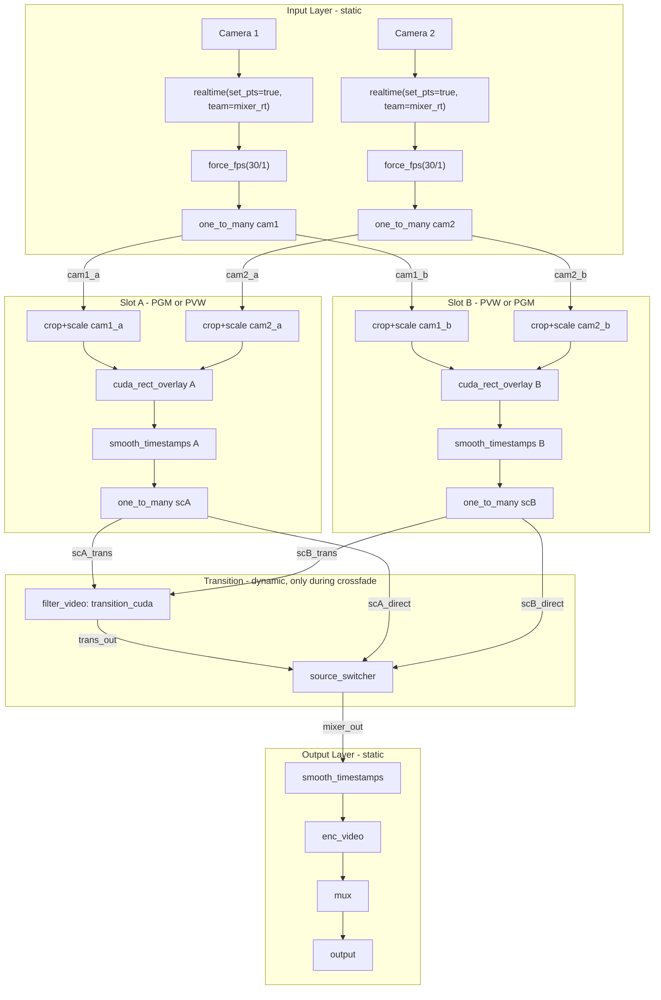

# Video Mixer / Scene Switcher for avplumber

## Architecture Overview

Fixed 2-slot (PGM/PVW) architecture. Multiple scenes can be defined, but only 2 compositors exist. The inactive slot is reconfigured for the target scene before each transition. Key GPU-saving mechanisms:

- **`one_to_many`** (1-to-many): placed on each input after `force_fps`. Uses an **output bitmask** (timeline-driven) to control which outputs receive frames. Bits correspond to `[slot_a, slot_b]`. In steady state only one bit is set. During crossfade, bits for cameras used by both scenes are set. Cameras not used by a scene have that slot's bit cleared -- their crop/scale chain doesn't run.
- **Per-input crop/scale chain per slot**: `filter_video(graph="crop=...,scale_cuda=...")` between `one_to_many` and `cuda_rect_overlay`. Reconfigured via `node.param.set` + `node.auto_restart` while the slot is idle (no frames flowing).
- **`cuda_rect_overlay` `active_inputs`**: bitmask (timeline-driven) telling the compositor which inputs to wait for. Inactive inputs are skipped in the sync loop. This allows the compositor to run with a subset of its wired inputs.
- **`source_switcher`** (many-to-1): placed before the output pipeline. Selects between slot A direct, slot B direct, and transition filter output.

In steady state, only the PGM scene's crop/scale chains and compositor run. During crossfade, the orchestrator creates `transition_cuda` dynamically and enables the PVW slot. No FFmpeg modifications needed.



## Graph Topology Details

### Input Layer (user-configured, static)

Each camera/source input follows this pattern:

```
node.add { "type": "input", "url": "...", "dst": "in_cam1_pkt", "group": "input", ... }
node.add { "type": "demux", "src": "in_cam1_pkt", "routing": {"v:0":"cam1_pkt"}, "group": "input" }
node.add { "type": "dec_video", "src": "cam1_pkt", "dst": "cam1_dec", "group": "input", "pixel_format": "?cuda", "hwaccel": "@gpu" }
node.add { "type": "realtime", "src": "cam1_dec", "dst": "cam1_rt", "set_pts": true, "team": "mixer_rt", "group": "input" }
node.add { "type": "force_fps", "src": "cam1_rt", "dst": "cam1_fps", "fps": "30/1", "group": "input" }
node.add { "type": "one_to_many", "name": "otm_cam1", "src": "cam1_fps", "dst": ["cam1_a", "cam1_b"], "outputs": 1, "timeline": "mixer_tl", "group": "mixer" }
```

- `realtime(set_pts=true, team=mixer_rt)`: rewrites PTS to wallclock time; the shared `mixer_rt` team synchronizes all inputs to a common baseline
- `force_fps`: normalizes frame rate so all inputs deliver frames at the same cadence into compositors
- `one_to_many(outputs=1)`: bitmask `0b01` = only output 0 (slot A). The orchestrator sets `outputs=3` (`0b11`) during crossfade for cameras shared between scenes, or `outputs=2` (`0b10`) for cameras only in slot B. Cameras not in a scene have that bit cleared -- no frames flow, no GPU cycles wasted on crop/scale.

### Per-Input Crop/Scale Chains (orchestrator-managed)

Between `one_to_many` and the compositor, each camera has a `filter_video` per slot wrapping `crop` + `scale_cuda`:

```
node.add { "type": "filter_video", "name": "cs_cam1_a", "src": "cam1_a", "dst": "cam1_a_scaled", "graph": "crop=1920:1080:0:0,scale_cuda=1920:1080", "hwaccel": "@gpu", "group": "mixer_a" }
node.add { "type": "filter_video", "name": "cs_cam1_b", "src": "cam1_b", "dst": "cam1_b_scaled", "graph": "crop=1920:1080:0:0,scale_cuda=640:360", "hwaccel": "@gpu", "group": "mixer_b" }
```

The crop/scale parameters encode the per-camera layout for each scene. Before a transition, the orchestrator reconfigures the idle slot's crop/scale chains via `node.param.set` + `node.auto_restart` -- safe because no frames are flowing (the one_to_many output bit for that slot is 0).

PTS is preserved through `crop` and `scale_cuda` (FFmpeg filters don't modify PTS).

### Scene Rendering Layer (orchestrator-managed, fixed 2 slots)

Each slot has a `cuda_rect_overlay` compositor wired to ALL camera crop/scale outputs for that slot. The compositor uses `active_inputs` (timeline-driven bitmask) to know which inputs to wait for. Inputs not in the current scene have their bit cleared.

```
node.add { "type": "cuda_rect_overlay", "name": "comp_a", "src": ["cam1_a_scaled", "cam2_a_scaled"], "dst": "scene_a_out", "hwaccel": "@gpu", "width": 1920, "height": 1080, "sw_format": "nv12", "layers": [...], "active_inputs": 3, "timeline": "mixer_tl", "group": "mixer_a" }
node.add { "type": "smooth_timestamps", "name": "sm_a", "src": "scene_a_out", "dst": "scene_a_sm", "fps": "30/1", "group": "mixer_a" }
node.add { "type": "one_to_many", "name": "otm_scene_a", "src": "scene_a_sm", "dst": ["scA_direct", "scA_trans"], "outputs": 1, "timeline": "mixer_tl", "group": "mixer_a" }
```

- `active_inputs=3` (`0b11`): both cam1 and cam2 active (e.g., PiP scene)
- `active_inputs=1` (`0b01`): only cam1 active (e.g., fullscreen cam1 scene)
- Post-compositor `one_to_many(outputs=1)`: in steady state, only output 0 (`scA_direct`) for `source_switcher`. During crossfade, `outputs=3` to also feed `scA_trans` for `transition_cuda`.

### Scene change: reconfiguring the idle slot

When the user requests a new scene (e.g., from "fullscreen cam1" on slot A to "PiP cam1+cam2" on slot B):

1. **Update crop/scale parameters** on slot B's chains (all cameras that appear in the new scene):
   - `node.param.set cs_cam1_b graph "crop=...,scale_cuda=1920:1080"` (fullscreen)
   - `node.param.set cs_cam2_b graph "crop=...,scale_cuda=480:270"` (PiP inset)
   - `node.auto_restart cs_cam1_b`, `node.auto_restart cs_cam2_b`
2. **Update compositor B layers**: `node.param.set comp_b layers [...]`
3. **Update `active_inputs`** on compositor B via timeline: set the bitmask for cameras used in this scene
4. **Update `outputs` bitmask** on camera one_to_many nodes: set slot B bit for cameras in the scene

All of this happens while slot B receives no frames (output bit = 0 on all camera one_to_many nodes). No timestamp issues, no dropped frames on the output.

### Transition Layer (dynamic -- only during crossfade)

`transition_cuda` does NOT exist in steady state. The orchestrator creates it dynamically when a crossfade starts:

```
node.add_start { "type": "filter_video", "name": "mixer_transition", "src": ["scA_trans", "scB_trans"], "dst": "trans_out", "graph": "transition_cuda=alpha='clip(n/90,0,1)':eval=frame", "hwaccel": "@gpu", "group": "mixer_trans" }
```

The `n` variable starts at 0 when the filter is created, producing a natural 0-to-1 ramp over `FRAMES = fps * duration_sec` frames. After the crossfade, the orchestrator deletes the transition node.

### Output Selection Layer (static)

The `source_switcher` node picks one of its inputs to forward to the output:

```
node.add { "type": "source_switcher", "name": "out_sel", "src": ["scA_direct", "scB_direct", "trans_out"], "dst": "mixer_out", "active": 0, "timeline": "mixer_tl", "group": "mixer" }
node.add { "type": "smooth_timestamps", "src": "mixer_out", "dst": "mixer_sm", "fps": "30/1", "group": "output" }
node.add { "type": "enc_video", "src": "mixer_sm", "dst": "v_enc", ..., "group": "output" }
```

- `active=0`: Scene A direct (steady state when Scene A is PGM)
- `active=1`: Scene B direct (steady state when Scene B is PGM)
- `active=2`: Transition output (during crossfade)

Non-active inputs are drained (popped without forwarding) to prevent queue buildup.

### Timestamp Flow

1. Camera inputs: arbitrary PTS, arbitrary timebase
2. `realtime(set_pts=true, team=mixer_rt)`: rewrites PTS to wallclock ms, timebase `{1, 1000}`
3. `force_fps(30/1)`: rescales to timebase `{1, 30}`, PTS values are frame counts (0, 1, 2, ...)
4. `one_to_many` (input): PTS/timebase unchanged; output bitmask controls which slot receives
5. `filter_video` (crop+scale_cuda): PTS preserved unchanged (FFmpeg filter passthrough)
6. `cuda_rect_overlay`: output PTS = min PTS of active inputs, same timebase
7. `smooth_timestamps`: cleans jitter, ensures monotonic PTS, same timebase
8. `one_to_many` (post-scene): routes to direct or transition path, PTS/timebase unchanged
9. `transition_cuda` (framesync, only during crossfade): matches Scene A and B frames by PTS
10. `source_switcher`: passes through active input, PTS/timebase unchanged
11. `smooth_timestamps` after source_switcher: final cleanup for encoder

### Steady-State Efficiency

When not transitioning:
- Input `one_to_many` output bitmask has only the PGM slot bit set -- frames flow only to PGM crop/scale chains
- PVW slot's crop/scale chains and compositor receive no frames (blocked on empty queues)
- Only the PGM compositor runs GPU kernels
- No `transition_cuda` filter exists (no GPU blend kernel running)
- Post-compositor `one_to_many` has only the direct bit set -- no transition path overhead
- GPU cost: N active crop/scale filters + 1 compositor + 0 transition filter
- Cameras not used in the PGM scene have their PGM bit cleared too -- their crop/scale chain is idle

---

## Component 1: `SharedTimeline` (instance-shared object)

New file: [src/SharedTimeline.hpp](src/SharedTimeline.hpp) (~100 LOC)

A general-purpose **current-value store over time**. The orchestrator (or control commands) declares "at PTS T, key K for channel C should become value V." Nodes query the timeline during `process()` to read the value that should be active at the current frame's PTS. The timeline is not consumed -- it's a persistent lookup table, making it idempotent and restart-resilient.

```cpp
class SharedTimeline : public InstanceShared<SharedTimeline> {
    struct Entry { int64_t at_pts_ms; Parameters value; };
    // channel -> key -> sorted vector of {at_pts_ms, value}
    std::unordered_map<std::string,
        std::unordered_map<std::string, std::vector<Entry>>> data_;
    std::mutex mutex_;
public:
    // Declare: "starting at at_pts_ms, key for channel should be value"
    void set(const std::string& channel, const std::string& key,
             int64_t at_pts_ms, const Parameters& value) {
        std::lock_guard<std::mutex> lock(mutex_);
        auto& entries = data_[channel][key];
        entries.push_back({at_pts_ms, value});
        std::sort(entries.begin(), entries.end(),
                  [](auto& a, auto& b){ return a.at_pts_ms < b.at_pts_ms; });
    }

    // Query: "what should key be for channel at this frame PTS?"
    // Returns the value from the latest entry with at_pts_ms <= frame_pts.
    // Uses av_compare_ts internally so frame timebase doesn't matter.
    // Returns nullopt if no entry exists at or before frame_pts.
    std::optional<Parameters> get(const std::string& channel,
                                   const std::string& key,
                                   const av::Timestamp& frame_pts) const {
        std::lock_guard<std::mutex> lock(mutex_);
        auto ch_it = data_.find(channel);
        if (ch_it == data_.end()) return std::nullopt;
        auto key_it = ch_it->second.find(key);
        if (key_it == ch_it->second.end()) return std::nullopt;
        auto& entries = key_it->second;
        // Binary search: find latest entry with at_pts_ms <= frame_pts
        std::optional<Parameters> result;
        for (auto& e : entries) {
            av::Timestamp entry_ts(e.at_pts_ms, {1, 1000});
            if (frame_pts >= entry_ts) // av_compare_ts handles {1,30} vs {1,1000}
                result = e.value;
            else
                break;
        }
        return result;
    }

    // Typed convenience with default
    template<typename T>
    T getOr(const std::string& channel, const std::string& key,
            const av::Timestamp& frame_pts, const T& default_val) const {
        auto opt = get(channel, key, frame_pts);
        return opt ? opt->get<T>() : default_val;
    }

    // Remove all entries for a channel (e.g., when tearing down a node)
    void clear(const std::string& channel) {
        std::lock_guard<std::mutex> lock(mutex_);
        data_.erase(channel);
    }

    // GC: remove entries with at_pts_ms < threshold for all channels
    void gc(int64_t before_pts_ms) {
        std::lock_guard<std::mutex> lock(mutex_);
        for (auto& [ch, keys] : data_) {
            for (auto& [key, entries] : keys) {
                // Keep the latest entry before threshold (it's the "current" value)
                // plus all entries at or after threshold
                auto it = entries.begin();
                while (it != entries.end() && std::next(it) != entries.end()
                       && std::next(it)->at_pts_ms <= before_pts_ms) {
                    it = entries.erase(it);
                }
            }
        }
    }
};
```

**Key properties:**
- **Idempotent reads.** Querying twice at the same PTS returns the same answer. No state is consumed.
- **Restart-resilient.** If a node is killed and recreated via `node.auto_restart`, it queries the timeline on the next frame and gets the correct current state -- nothing was lost.
- **Late-joining.** A dynamically created node (like `transition_cuda`) can immediately read the correct state from the timeline.
- **Debuggable.** The full state history is inspectable at any time.

### Timebase handling

- `wallclock` (global in `avutils.hpp`): `steady_clock`, timebase `{1, 1000}` (ms). `wallclock.pts()` returns ms since start.
- `realtime(set_pts=true)`: outputs PTS in `{1, 1000}` (ms).
- `force_fps(30/1)`: rescales to `{1, 30}` (frame counts). PTS 300 = 10 seconds.

Timeline entries store `at_pts_ms` in wallclock milliseconds. The `get()` comparison wraps each entry as `av::Timestamp(at_pts_ms, {1,1000})` and uses `operator>=` which calls `av_compare_ts` -- so `av::Timestamp(300, {1,30})` correctly compares equal to `av::Timestamp(10000, {1,1000})` (both = 10 seconds).

### Control protocol

```
timeline.set <timeline_name> <channel> <at_pts_ms> <key> <value_json>
```
Set a value on the timeline. Example: `timeline.set mixer_tl sw_cam1 1234567 mode "split"`

```
timeline.batch <timeline_name> <events_json_array>
```
Set multiple values atomically. Example:
`timeline.batch mixer_tl [{"ch":"sw_cam1","at":1234567,"key":"mode","val":"split"},{"ch":"out_sel","at":1234567,"key":"active","val":2}]`

```
timeline.clear <timeline_name> [channel]
```
Remove entries. If channel omitted, clears entire timeline.

### Integration with nodes (TimelineReader mixin)

Nodes opt in by taking a `timeline` parameter and inheriting `TimelineReader`:

```cpp
class TimelineReader {
    std::shared_ptr<SharedTimeline> timeline_;
    std::string channel_;
protected:
    void initTimeline(const NodeCreateInfo& nci) {
        if (nci.params.count("timeline")) {
            timeline_ = InstanceSharedObjects<SharedTimeline>::get(
                nci.instance, nci.params["timeline"]);
            channel_ = nci.params.at("name");
        }
    }
    template<typename T>
    T tlGet(const std::string& key, const av::Timestamp& pts, const T& fallback) const {
        if (!timeline_) return fallback;
        return timeline_->getOr<T>(channel_, key, pts, fallback);
    }
    bool hasTimeline() const { return timeline_ != nullptr; }
};
```

Nodes call `tlGet<int>("active", frame_pts, 0)` in their `process()`. No `setObject`, no internal state needed for timeline-driven parameters. Immediate `node.object.set` still works by setting internal state that serves as the fallback when no timeline entry exists.

---

## Component 2: `one_to_many` node

New file: [src/nodes/one_to_many.cpp](src/nodes/one_to_many.cpp) (~60 LOC)

Extends `NodeSingleInput<T>` + `NodeMultiOutput<T>` + `TimelineReader` + `IInputsObjects`. Uses an **output bitmask** (integer) to control which outputs receive the frame. Each bit corresponds to an output index. The node queries the timeline every frame for the `outputs` key; the internal atomic serves as a fallback.

```cpp
template<typename T>
class OneToMany : public NodeSingleInput<T>, public NodeMultiOutput<T>,
                      public TimelineReader, public IInputsObjects {
    std::atomic<uint32_t> outputs_mask_{1}; // default: only output 0

    virtual void process() {
        T* data = this->source_->peek();
        if (!data) return;

        uint32_t mask = this->tlGet<uint32_t>("outputs", data->pts(), outputs_mask_.load());

        for (size_t i = 0; i < this->sink_edges_.size(); i++) {
            if (mask & (1u << i))
                EdgeSink<T>(this->sink_edges_[i]).put(*data, true);
        }
        this->source_->pop();
    }

    void setObject(const std::string key, const Parameters& value) override {
        if (key == "outputs")
            outputs_mask_ = value.get<uint32_t>();
    }
};
```

Parameters:
- `outputs` (int, default `1` = bit 0) -- bitmask of which outputs to send to
- `timeline` (string, optional) -- name of `SharedTimeline` instance-shared object

Examples for a 2-output node (slot_a=bit0, slot_b=bit1):
- `outputs=1` (`0b01`): only slot A receives frames (steady state, PGM on A)
- `outputs=2` (`0b10`): only slot B receives frames (steady state, PGM on B)
- `outputs=3` (`0b11`): both slots receive frames (crossfade, camera in both scenes)
- `outputs=0`: no outputs -- discard frames (camera not used in any active scene)

Immediate control: `node.object.set otm_cam1 outputs 3`
Timeline control (PTS-synced): `timeline.set mixer_tl otm_cam1 1234567 outputs 3`

---

## Component 3: `source_switcher` node

New file: [src/nodes/source_switcher.cpp](src/nodes/source_switcher.cpp) (~50 LOC)

This is the shipped many-to-1 switcher (timeline-driven, orchestrator-controlled). It is unrelated to the legacy timeout-based stub in [src/nodes/_unfinished/source_switcher.cpp](src/nodes/_unfinished/source_switcher.cpp); that file can stay as reference or be removed once this node lands.

Extends `NodeMultiInput<T>` + `NodeSingleOutput<T>` + `TimelineReader` + `IInputsObjects`. Same pattern: queries timeline every frame, internal state as fallback.

```cpp
template<typename T>
class SourceSwitcher : public NodeMultiInput<T>, public NodeSingleOutput<T>,
                       public TimelineReader, public IInputsObjects {
    std::atomic<int> active_input_{0};

    virtual void process() {
        int srci = this->findSourceWithData();
        if (srci < 0) return;
        for (int i = 0; i < (int)this->source_edges_.size(); i++) {
            T* data = this->source_edges_[i]->peek();
            if (!data) continue;
            int active = this->tlGet<int>("active", data->pts(), active_input_.load());
            if (i == active)
                this->sink_->put(*data);
            this->source_edges_[i]->pop();
        }
    }

    void setObject(const std::string key, const Parameters& value) override {
        if (key == "active")
            active_input_ = value.get<int>();
    }
};
```

Parameters:
- `active` (int, default `0`) -- which input to forward
- `timeline` (string, optional) -- name of `SharedTimeline` instance-shared object

Inputs with no upstream producer (e.g., `trans_out` when transition_cuda doesn't exist) simply never produce data -- `peek()` returns null and they are skipped.

---

## Component 4: `cuda_rect_overlay` `active_inputs` extension

Modify existing file: [src/nodes/hwaccel/cuda_rect_overlay.cpp](src/nodes/hwaccel/cuda_rect_overlay.cpp)

Add `TimelineReader` + `IInputsObjects` to `CudaRectOverlay`. A new `active_inputs` bitmask parameter controls which inputs the sync loop waits for. Inactive inputs are completely skipped -- no peek, no wait, no blit.

Changes to class declaration:

```cpp
class CudaRectOverlay : public NodeMultiInput<av::VideoFrame>,
                        public NodeSingleOutput<av::VideoFrame>,
                        public IVideoFormatSource, public IFrameRateSource,
                        public ITimeBaseSource,
                        public TimelineReader,     // NEW
                        public IInputsObjects {    // NEW
    // ...
    std::atomic<uint32_t> active_inputs_{~0u}; // default: all active
```

Changes to `process()` (minimal -- ~15 lines changed):

The sync loop currently iterates over all `n` inputs unconditionally. With this change, at the top of `process()` we read the active mask:

```cpp
void process() override {
    // ... existing EOF checks ...

    // Read active_inputs from timeline or fallback
    // Need a representative PTS for timeline lookup -- use any peeked frame
    av::Timestamp ref_pts = NOTS;
    for (size_t i = 0; i < n; ++i) {
        auto* p = this->source_edges_[i]->peek();
        if (p && !isEofMarker(*p) && frameUsable(*p)) { ref_pts = p->pts(); break; }
    }
    uint32_t active = hasTimeline() && !ref_pts.isNoPts()
        ? tlGet<uint32_t>("active_inputs", ref_pts, active_inputs_.load())
        : active_inputs_.load();

    // Helper lambda replaces bare index checks:
    auto isActive = [active](size_t i) { return (active & (1u << i)) != 0; };
```

Then every loop in `process()` that iterates over inputs adds `if (!isActive(i)) continue;` as the first check. Specifically:
- min_ts scan: skip inactive
- old-frame discard loop: skip inactive
- frame matching loop: skip inactive (set `src_for_layer[i] = nullptr`)
- meta_src search: skip inactive
- consume loop: skip inactive
- processComposite: already handles `nullptr` entries in `src_for_layer`

`setObject` for immediate control:

```cpp
void setObject(const std::string key, const Parameters& value) override {
    if (key == "active_inputs")
        active_inputs_ = value.get<uint32_t>();
}
```

Init adds `initTimeline(nci)` and reads `active_inputs` from params.

This is a minimal, self-contained change (~30 LOC delta). The compositor already handles `nullptr` entries in `src_for_layer` (it skips blitting for null layers), so `processComposite` needs no changes.

---

## PTS-Synchronized Switching

### Orchestrator writes to SharedTimeline

The orchestrator computes target PTS from current wallclock and writes entries into the shared timeline. Because nodes query the timeline every frame, the values take effect at exactly the right PTS.

```cpp
auto tl = InstanceSharedObjects<SharedTimeline>::get(instance, "mixer_tl");
int64_t T_start = wallclock.pts() + margin_ms; // e.g., +200ms
int64_t T_end = T_start + (int64_t)(duration_sec * 1000);

// At T_start: output switches to transition
tl->set("out_sel",       T_start, "active",  2);     // transition output
tl->set("otm_scene_a",   T_start, "outputs", 0b10);  // trans only
tl->set("otm_scene_b",   T_start, "outputs", 0b10);  // trans only

// At T_end: output switches to Scene B direct
tl->set("out_sel",       T_end,   "active",  1);     // Scene B direct
tl->set("otm_scene_b",   T_end,   "outputs", 0b01);  // direct only
tl->set("otm_scene_a",   T_end,   "outputs", 0b00);  // idle
```

The `margin_ms` ensures all `set()` calls complete before any node sees a frame at `T_start`. Each node independently reads its current value when it processes a frame -- **same frame PTS, regardless of queue depth between nodes**.

Camera one_to_many output bitmasks are set IMMEDIATELY (not PTS-scheduled) during the setup phase because the PVW slot needs frames to prime the pipeline before T_start. The PTS-scheduled entries above control only the output selection and post-scene routing, which need frame-accurate switching.

---

## Component 5: MixerState (instance-shared object)

New file: [src/MixerState.hpp](src/MixerState.hpp) (~80 LOC)

```cpp
struct CameraLayout {
    std::string crop_scale_graph; // e.g., "crop=1920:1080:0:0,scale_cuda=640:360"
};

struct SceneDefinition {
    std::string name;
    // Per-camera layout: camera_name -> crop/scale params + layer spec
    std::unordered_map<std::string, CameraLayout> cameras;
    nlohmann::json layers; // cuda_rect_overlay layers array
    int width = 1920, height = 1080;
};

struct MixerState : public InstanceShared<MixerState> {
    std::mutex mutex;

    // Input registry: logical_name -> one_to_many node name
    // Outputs are named: {name}_a, {name}_b (for slot A, B)
    struct CameraInfo {
        std::string otm_node_name;           // "otm_cam1"
        int input_index;                     // index within compositor src array
        std::string cs_node_a, cs_node_b;    // "cs_cam1_a", "cs_cam1_b"
    };
    std::unordered_map<std::string, CameraInfo> cameras;

    // Scene registry
    std::unordered_map<std::string, SceneDefinition> scenes;

    // A/B slot tracking
    bool pgm_is_slot_a = true;
    std::string pgm_scene_name;
    std::string pvw_scene_name;

    // FPS for frame count calculations
    int fps_num = 30, fps_den = 1;

    // Transition state
    enum class TransitionMode { Idle, Crossfade, Wipe };
    std::atomic<TransitionMode> transition_mode{TransitionMode::Idle};

    // Node names the orchestrator manages (static, created once)
    struct SlotNodes {
        std::string compositor_name;     // "comp_a" / "comp_b"
        std::string smooth_ts_name;      // "sm_a" / "sm_b"
        std::string post_otm_name;       // "otm_scene_a" / "otm_scene_b"
    };
    SlotNodes slot_a, slot_b;
    std::string source_switcher_name;    // "out_sel"
};
```

---

## Component 6: MixerOrchestrator

New files: [src/mixer_orchestrator.hpp](src/mixer_orchestrator.hpp), [src/mixer_orchestrator.cpp](src/mixer_orchestrator.cpp) (~400 LOC)

The orchestrator holds a reference to `NodeManager`, `MixerState`, and `SharedTimeline`. It does NOT process media data -- it manages the graph topology and pushes PTS-scheduled state changes into the shared timeline.

### Key Methods

- **`defineCamera(name, otm_node_name, input_index)`** -- register a camera by its `one_to_many` node name and input index in the compositor
- **`defineScene(name, definition)`** -- register a scene composition (which cameras, crop/scale params, layer layout)
- **`loadScene(slot, scene_name)`** -- reconfigure an idle slot for a scene
  1. Compute `active_inputs` bitmask for the compositor (which camera indices appear in this scene)
  2. For each camera in the scene: `node.param.set` the crop/scale chain for this slot + `node.auto_restart`
  3. Update compositor `layers` if layout changed: `node.param.set comp_{slot} layers [...]`
  4. Write `active_inputs` to timeline for the compositor
  5. The slot's compositor, smooth_timestamps, post-otm are STATIC (created once at init) -- only their parameters/timeline values change
- **`cut(scene_name)`** -- instant scene switch (PTS-scheduled)
  1. Load target scene into PVW slot (reconfigure crop/scale + compositor params)
  2. Compute T_cut, write to timeline: camera otm `outputs` bitmask (PVW bit set for cameras in target scene), compositor `active_inputs`, source_switcher `active`
  3. After T_cut: write otm `outputs` back to PGM-only, update pgm_is_slot
- **`fade(scene_name, duration_sec)`** -- crossfade transition (see detailed flow below)
- **`wipe(scene_name, wipe_file, wipe_duration)`** -- media wipe transition (see Media Wipe section)

### Crossfade Flow (Scene A on slot A -> Scene B on slot B)

Uses PTS-scheduled switching so all nodes transition at exactly the same frame boundary. Three phases: setup (immediate), scheduled (PTS-triggered), cleanup.

Assume PGM is slot A. Camera set for scene A: `{cam1, cam2}`. Camera set for scene B: `{cam1, cam3}`. cam1 is shared.

```
 Orchestrator                     Graph / bitmask effect
 ────────────                     ──────────────────────

 SETUP PHASE (immediate, before target PTS):

 1. loadScene(slot_b, scene_b)    Reconfigure slot B crop/scale chains + comp_b layers
                                  for scene B. (Safe: slot B bit=0, no frames flowing)
 2. Create transition_cuda:       node.add_start filter_video with
    alpha='clip(n/FRAMES,0,1)'    src=["scA_trans","scB_trans"], dst="trans_out"
 3. Set camera otm outputs        cam1: outputs |= 0b10 (add slot B bit) -> 0b11 (both)
    IMMEDIATELY via node.object   cam3: outputs |= 0b10 -> 0b10 (slot B only)
                                  cam2: unchanged (0b01, slot A only, not in scene B)
 4. Set comp_b active_inputs      Bitmask for cameras in scene B
    IMMEDIATELY via node.object
 5. Set post-scene otm_scene_a    outputs = 0b11 (direct + trans)
    and otm_scene_b IMMEDIATELY   outputs = 0b11 (direct + trans)
                                  transition_cuda starts receiving + producing frames

 TIMELINE WRITE PHASE (all written now, nodes consume at correct PTS):

 6. Compute T_start = now + margin_ms (e.g., 200ms)
    Compute T_end = T_start + duration_sec * 1000

 7. Write to timeline at T_start:
    - out_sel:      active = 2 (switch to transition output)
    - otm_scene_a:  outputs = 0b10 (trans only, stop direct waste)
    - otm_scene_b:  outputs = 0b10 (trans only)

 8. Write to timeline at T_end:
    - out_sel:      active = 1 (switch to Scene B direct)
    - otm_scene_b:  outputs = 0b01 (direct only)
    - otm_scene_a:  outputs = 0b00 (idle)

 Between steps 5 and T_start, transition_cuda warms up but source_switcher
 still reads active=0 (slot A direct). First visible blend frame has
 alpha ~ 0, visually indistinguishable from scene A.

 CLEANUP PHASE (after T_end fires, detected by timer):

 9.  Delete transition_cuda       No more GPU blend overhead
 10. Set camera otm outputs:      cam1: 0b10 (slot B only), cam3: 0b10
     cam2: 0b00 (not in scene B)  cam2 crop/scale chain goes idle
 11. Set comp_a active_inputs = 0 Compositor A stops (no active inputs)
 12. Update pgm_is_slot_a=false
```

The key insight: steps 7 and 8 write timeline entries that all nodes independently read when processing their frames. Because `realtime(set_pts=true)` maps PTS to wallclock, every node reads the new value at exactly the right PTS, regardless of queue depth. And because reads are idempotent, node restarts mid-crossfade are safe.

The `margin_ms` (~200ms = ~6 frames at 30fps) gives time to:
- Write all timeline entries before any node sees a frame with PTS >= T_start
- Let transition_cuda warm up with frames before the output switches to it

Cameras NOT shared between scenes (cam2 in this example) keep their PGM-only bitmask through the entire transition and only have their bit cleared at cleanup. This means cam2 still feeds scene A's compositor during the fade (needed for the outgoing scene), then goes idle after.

### Hard Cut

For instant scene switching, skip the transition filter. PTS-scheduled so input and output switch at the same frame:

1. `loadScene(pvw_slot, target_scene)` -- reconfigure idle slot
2. Set camera otm outputs IMMEDIATELY: add PVW bit for cameras in target scene, set comp active_inputs
3. Compute T_cut = now + margin_ms
4. Write to timeline at T_cut: out_sel active = PVW direct, camera otm outputs = PVW-only for target cameras
5. After T_cut: set old slot's camera bits to 0, comp active_inputs to 0, flip pgm_is_slot

### PGM/PVW Slot Tracking

The orchestrator alternates which slot is PGM:

- Initially: slot A = PGM, source_switcher active=0 (`scA_direct`), camera otm outputs = bit 0
- After fade A->B: slot B = PGM, source_switcher active=1 (`scB_direct`), camera otm outputs = bit 1
- Next fade B->C: load C into slot A (reconfigure crop/scale + layers), create transition with `src=["scA_trans","scB_trans"]`, alpha `clip(1-n/FRAMES,0,1)` (reverse: B fades out, A fades in). After completion: slot A = PGM, active=0, camera otm outputs = bit 0
- The `transition_cuda` src order is always `["scA_trans","scB_trans"]` -- only the alpha expression direction changes
- `active_inputs` on each compositor is updated per scene load to reflect which cameras participate

---

## Component 7: Control Commands

Additions to [src/avplumber.cpp](src/avplumber.cpp):

### Timeline commands (general-purpose, not mixer-specific)

```
timeline.set <name> <channel> <at_pts_ms> <key> <value_json>
```
Write a value on the timeline. Example: `timeline.set mixer_tl sw_cam1 1234567 mode "split"`

```
timeline.batch <name> <entries_json_array>
```
Write multiple entries atomically. Example:
`timeline.batch mixer_tl [{"ch":"sw_cam1","at":1234567,"key":"mode","val":"split"},{"ch":"out_sel","at":1234567,"key":"active","val":2}]`

```
timeline.clear <name> [channel]
```
Remove entries. If channel omitted, clears entire timeline.

```
timeline.gc <name> <before_pts_ms>
```
Garbage-collect old entries that are no longer needed.

### Mixer commands

```
mixer.input name queue_name
```
Register input. Example: `mixer.input cam1 cam1_rt`

```
mixer.scene name { json_definition }
```
Define scene. Example: `mixer.scene fullcam1 {"compositor":"cuda_rect_overlay","inputs":["cam1"],"width":1920,"height":1080,"sw_format":"nv12","layers":[{"dst_x":0,"dst_y":0}]}`

```
mixer.preview scene_name
```
Load scene into preview slot (build renderer, but don't switch yet).

```
mixer.cut [scene_name]
```
Hard cut to scene (loads into preview first if not already there).

```
mixer.fade scene_name duration_sec
```
Crossfade to scene over duration.

```
mixer.wipe scene_name wipe_file [duration_sec]
```
Media wipe to scene. If duration not specified, read from file metadata.

```
mixer.status
```
Return current PGM scene, PVW scene, transition state, alpha.

---

## Media Wipe Detail

The wipe video is a file with an alpha channel (e.g., ProRes 4444, VP9 with alpha, etc.) whose alpha goes transparent -> opaque -> transparent. The fully opaque midpoint covers the hard cut beneath.

Playback chain (orchestrator creates dynamically):

```
input_rec(url=wipe.mov, loop=false) → demux(routing={"v:0":"wipe_pkt"})
→ dec_video → filter_video(graph="format=yuva420p,hwupload_cuda")
→ realtime(set_pts=true) → wipe_video_out
```

During wipe, the output pipeline becomes:

```
mixer_out → overlay_many_cuda(inputs=2, src=[mixer_out, wipe_video_out]) → output_pipeline
```

The wipe video's alpha channel determines the overlay blend. At the midpoint, the orchestrator performs `cut(scene_name)` which changes the underlying scene in the transition layer. Since the wipe fully covers the screen at this moment, the cut is invisible.

After the wipe video reaches EOF, the orchestrator removes the overlay node and wipe playback chain.

---

## Files to Create/Modify

- **Create** [src/SharedTimeline.hpp](src/SharedTimeline.hpp) -- shared timeline (current-value store) + `TimelineReader` mixin (~100 LOC)
- **Create** [src/nodes/one_to_many.cpp](src/nodes/one_to_many.cpp) -- 1-to-many switcher node with output bitmask (~50 LOC)
- **Create** [src/nodes/source_switcher.cpp](src/nodes/source_switcher.cpp) -- many-to-1 switcher node (~50 LOC)
- **Modify** [src/nodes/hwaccel/cuda_rect_overlay.cpp](src/nodes/hwaccel/cuda_rect_overlay.cpp) -- add `active_inputs` bitmask + `TimelineReader` + `IInputsObjects` (~30 LOC delta)
- **Create** [src/MixerState.hpp](src/MixerState.hpp) -- mixer state instance-shared object (~80 LOC)
- **Create** [src/mixer_orchestrator.hpp](src/mixer_orchestrator.hpp) -- orchestrator header (~60 LOC)
- **Create** [src/mixer_orchestrator.cpp](src/mixer_orchestrator.cpp) -- orchestrator implementation (~400 LOC)
- **Modify** [src/avplumber.cpp](src/avplumber.cpp) -- register timeline + mixer commands (~140 LOC)
- **Create** [examples/mixer.avplumber](examples/mixer.avplumber) -- example setup script (~60 LOC)

No FFmpeg modifications required. Node files in `src/nodes/` are auto-discovered by the Makefile.

---

## Open Questions / Decisions

- **Audio:** This plan covers video only. Audio mixing (crossfade audio during transitions) can follow the same pattern using `resample_audio` + `filter_audio` with `amix`. Audio is simpler since it doesn't need GPU compositing.
